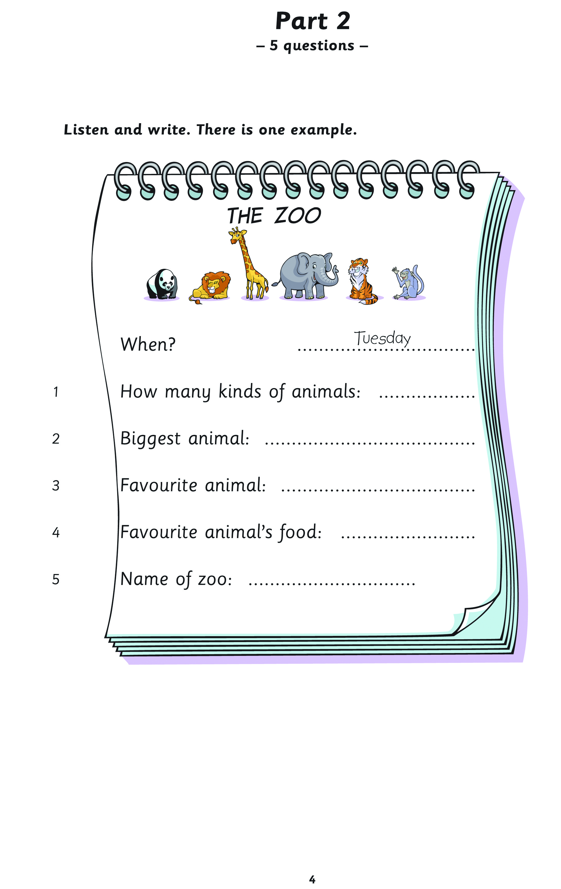

# 

**Author:** 
---

---
*Page 1*
---

Sample papers 
© UCLES 2013 | CE/2051b/3Y11 

## Young Learners

Young Learners English Tests (YLE) 
Movers 
2 
Volume  Two 

---
*Page 2*
---

## Introduction

Cambridge English: Young Learners  is a series of fun, motivating English language tests for children in primary and lower  secondary education. The tests are an excellent way for children to gain confidence and improve their English. 
There are three levels: 
•  Cambridge English: Starters 
•  Cambridge English: Movers 
•  Cambridge English: Flyers 
About these sample papers 
These sample papers show you what the  Cambridge English: Movers  test looks like. When children know what to expect in  the test, they will feel more confident and prepared. 
To prepare for  Cambridge English: Movers , children can practise parts of the test or do the complete practice test. 
Listening sample test 
To download the  Cambridge English: Movers  Listening sample test go to
   www.cambridgeenglish.org/movers-audio-sample-v2 
For further information about the three levels of  Cambridge English: Young Learners  and for more sample papers, go to 
 www.cambridgeenglish.org/younglearners 

---
*Page 3*
---

Movers    Listening 
There are 25 questions. 
You will need coloured pens and pencils. 
Cambridge Young Learners English Movers Listening 
Sample Paper 
Centre Number  Candidate Number 
My name is:   .......................................................................................... 
Go to the  Introduction  to download  the Listening sample test. 

--- *Tables Found* ---

### Table 1

| 0   | 1   | 2                                                                                                       | 3   | 4   |
|:----|:----|:--------------------------------------------------------------------------------------------------------|:----|:----|
|     |     | Centre Number                                                                                           |     |     |
|     |     | Candidate Number                                                                                        |     |     |
|     |     | Cambridge Young Learners English                                                                        |     |     |
|     |     | Movers                                                                                                  |     |     |
|     |     | Listening                                                                                               |     |     |
|     |     | Sample Paper                                                                                            |     |     |
|     |     | There are 25 questions.                                                                                 |     |     |
|     |     | You will need coloured pens and pencils.                                                                |     |     |
|     |     | My name is:  .......................................................................................... |     |     |

---
*Page 4*
---

Movers    Listening 

## Part 1 – 5 questions –

Listen and draw lines. There is one example. 
Peter  Jim  John  Sally 
Jane  Daisy  Anna 

--- *Tables Found* ---

### Table 1

| 0   | 1   | 2   |
|:----|:----|:----|
|     |     |     |
|     |     |     |
|     |     |     |
|     |     |     |
|     |     |     |
|     |     |     |
|     |     |     |
|     |     |     |
|     |     |     |
|     |     |     |
|     |     |     |
|     |     |     |
|     |     |     |
|     |     |     |
|     |     |     |

---
*Page 5*
---

*(This page was processed with OCR)*
Part 2

— 5 questions —

00
—
Cc
oO
or)
Bue
|

wn

h

oO

=>
=

Listen and write. There is one example.

THE ZOO

Ay te"

When? Tuesday

How many kinds of animals:

Biggest Animal: 0.0... ceceeeeeeeeeeeeeeeeeeeeeeees

Favourite animal:

Cr

Favourite animal’s food:

Name Of ZOO: ......ceeeeeseeeeeeeeeeeeeeeees Zoo

---
*Page 6*
---

Movers    Listening 

## Part 3 – 5 questions –

What did Sally do last week? 
Listen and draw a line from the day to the correct picture. 
There is one example. 
 
 
 
Monday 
Tuesday 
Wednesday 
Thursday 
Friday 
Sunday 
Saturday 

--- *Tables Found* ---

### Table 1

| 0   |
|:----|
|     |

### Table 2

| 0   |
|:----|
|     |
|     |

### Table 3

| 0   |
|:----|
|     |
|     |

### Table 4

| 0   |
|:----|
|     |

### Table 5

| 0   |
|:----|
|     |
|     |

---
*Page 7*
---

Movers    Listening 

## Part 4 – 5 questions –

Listen and tick ( ✓ ) the box. There is one example. 
Where did Jim see the film? 
 

### A     B     C   ✓

1  Where did the rabbits in the film go? 
 

### A     B     C

2  Where did the children have their lunch? 
 

### A     B     C

--- *Tables Found* ---

### Table 1

| 0   | 1   | 2   |
|:----|:----|:----|
|     |     |     |

### Table 2

| 0   |
|:----|
|     |

### Table 3

| 0   |
|:----|
|     |
|     |
|     |
|     |
|     |

### Table 4

| 0   |
|:----|
|     |

---
*Page 8*
---

Movers    Listening 
3  What did the children eat? 
 

### A     B     C

4  What did the children do after lunch? 
 

### A     B     C

5  What did Jim’s friends give him? 
 

### A     B     C

--- *Tables Found* ---

### Table 1

| 0   |
|:----|
|     |
|     |
|     |

### Table 2

| 0   |
|:----|
|     |
|     |
|     |

### Table 3

| 0   |
|:----|
|     |
|     |
|     |

---
*Page 9*
---

*(This page was processed with OCR)*
SS

it
[t=
qe my
—<
))

---
*Page 10*
---

## Movers    Listening

## Movers Listening

## Marking Key

Part 1   5 marks 
Lines should be drawn between: 
1 	 Sally and girl painting rainbow 
2 	 Peter and boy in blue T-shirt and jeans, 
painting leaves 
3 	 Daisy and girl carrying box of drinks 
4 	 Jim and boy taking photos 
5 	 Jane and girl sitting down and drinking 
Part 2  5 marks 
1 	 30/thirty (kinds of animals) 
2 	 (the) elephant(s) 
3 	 (the) parrot(s) 
4 	 (all kinds of)/(some) fruit 
5 	 W-I-L-D 
Part 3  5 marks 
Thursday	 Friday 
Monday	 Sunday (example) 
Saturday	 Wednesday 
Part 4  5 marks 
1 	 B 
2 	 B 
3 	 A 
4 	 C 
5 	 C 
Part 5  5 marks 
1 	 Colour clock – blue 
2 	 Write ‘MAP’ below map on wall 
3 	 Colour star on boy’s sweater – green 
4 	 Colour comic on desk – red 
5 	 Colour eraser on desk – brown 
( )	 =	 Acceptable extra words are placed in 
brackets 
/	 =	 A single slash is placed between 
acceptable alternative words within an  answer 
//	 =	 A double slash is placed between 
acceptable alternative complete  answers 

---
*Page 11*
---

## Movers    Listening

R = rubric 
F  = Female adult 
M  = Male adult 
Fch  = Female child 
Mch  = Male child 

## Movers Listening

## Tapescript

R  Hello. This is the University of Cambridge Movers  Listening Test. 
Look at Part One.  Look at the picture.  Listen and  look. 
There is one example. 
M 	 Excuse me.  What are you all doing? 
Fch 	 We’re drawing and painting on this wall. 
M 	 Oh.  A wall picture!  Are these all your friends? 
Fch 	 Yes.  But one is my brother, John. 
M 	 Is he the boy who’s painting a rainbow? 
Fch 	 Yes, you’re clever!  How did you know? 
M 	 His hair is blond, like yours. 
R  Can you see the line? This is an example.  
 Now you listen and draw lines. 
One 
M 	 That’s a beautiful rainbow. 
Fch 	 Yes, it is.  John’s very good at painting. 
M 	 Who’s the girl that’s helping to paint it? 
Fch 	 The one who’s standing on a box? 
M 	 Yes. 
Fch 	 That’s Sally. 
R  Two 
M 	 Who’s the boy that’s painting the leaves? 
Fch 	 Which one? 
M 	 The one with jeans and a blue T-shirt. 
Fch 	 Oh, he’s called Peter. 
M 	 I love those leaves! 
R  Three 
Fch 	 Look at Daisy. 
M 	 What’s she doing? 
Fch 	 She’s bringing a box of drinks for the children. 
M 	 Oh yes!  I’m thirsty.  Can I have a drink, please? 
R  Four 
M 	 One boy isn’t painting.  He’s taking photos of the  children. 
Fch 	 The one with the purple shirt? 
M 	 Yes. 
Fch 	 That’s Jim.  He likes taking photos more than  painting. 
M 	 Mmmm. 
R  Five 
M 	 Who’s the girl who’s having a drink? 
Fch 	 The one with the curly hair? 
M 	 Yes. 
Fch 	 That’s my best friend, Jane. 
M 	 Why isn’t she painting? 
Fch 	 Well, she’s hot and tired, I think. 
R  Now listen to Part One again. 
 That is the end of Part One. 
Part Two.  Listen and look. There is one example. 
F 	 What’s your homework today, Paul? 
Mch 	 I’ve got to write about the zoo. 
F 	 When did you go to the zoo?  Was it last Tuesday? 
Mch 	 That’s right.  Last Tuesday. 
F 	 Well, that’s easy, then. 
Mch 	 Is it? 
R  Can you see the answer?  Now you listen and write. 
One 
F 	 How many different kinds of animals did you see at  the zoo? 
Mch 	 That’s difficult. 
F 	 Well, think about it. 
Mch 	 Oh…thirty, I think. 
F 	 Thirty! Good. 
R  Two 
F 	 What were the biggest animals that you saw? 
Mch 	 Erm… the giraffes, I think. 
F 	 Weren’t there any elephants? 
Mch 	 Oh yes, that’s right.  The elephants were the biggest! 
R  Three 
F 	 So, which animal did you like best in the zoo? 
Mch 	 I liked them all. 
F 	 Which was your favourite?  The lions? 
Mch 	 No, I liked the birds.  The parrots were my favourite. 
F 	 The parrots? 
Mch 	 Yes.  They were beautiful.  They were in a very  big cage. 
R  Four 
F 	 What do they eat? 
Mch 	 Well, they like all kinds of fruit. 
F 	 Did you give them some fruit? 

---
*Page 12*
---

## Movers    Listening

Mch 	 Yes we did.  They loved it! 
R  Five 
F 	 Oh, yes, one last thing – what was the name of the  zoo? 
Mch 	 Wild Zoo. 
F 	 How do you spell that? 
Mch 	 W-I-L-D. 
F 	 Oh yes, I know it.  Good.  Well, now you can start  your homework. 
R  Now listen to Part Two again. 
That is the end of Part Two. 
Part Three. Look at the pictures. What did Sally do  last week? Listen and look. There is one example. 
M 	 Hello, Sally. Did you have a good holiday last week? 
Fch 	 Not bad.  Sunday was good.  I flew my kite! 
M 	 Where did you do that? 
Fch 	 In the park. 
R  Can you see the line from the word Sunday? 
   On Sunday, Sally flew her kite in the park.  
   Now you listen and draw lines. 
One 
M 	 What did you do on Saturday? 
Fch 	 I went for a long walk with my mum and dad.  We  took our dog with us. 
M 	 Did you enjoy it? 
Fch 	 It was OK, but it was very windy that day.  In the  evening, we were all tired. 
R  Two 
M 	 Did you go shopping last week, Sally? 
Fch 	 Yes, we did.  We went to the shops in town on  Monday afternoon.  I bought a present for my  grandpa. 
M 	 Did you drive into town? 
Fch 	 Yes.  The weather was terrible that day and we didn’t  want to walk. 
R  Three 
M 	 And what did you do on Thursday, Sally? 
Fch 	 Which day? 
M 	 Thursday. 
Fch 	 Oh, I rode my bike in the park. 
M 	 With your friends? 
Fch 	 That’s right. 
R  Four 
Fch 	 I went shopping again on Wednesday! 
M 	 Did you? 
Fch 	 Yes, but I didn’t go to town that day.  I only went to  the shop in the village. 
M 	 What did you buy? 
Fch 	 Oh, we needed some bread and milk. 
M 	 Did you walk there? 
Fch 	 Yes, it’s very near. 
R  Five 
M 	 Which was your best day last week? 
Fch 	 Friday, I think. 
M 	 Why?  Did you go shopping again? 
Fch 	 No!  I don’t go shopping every day, you know!  I  invited my favourite cousin to come and play with  me. 
M 	 Oh.  That was good.  What did you do with her? 
Fch 	 We took our dogs for a walk in the fields.  It was very  hot that day. 
M 	 Great! 
R  Now listen to Part Three again.
   That is the end of Part Three. 
Part Four. Look at the pictures. Listen and look. 
   There is one example. 
Where did Jim see the film? 
Mch 	 I saw a good film last week. 
F 	 Oh, did your Mum take you to the cinema? 
Mch 	 No… 
F 	 Was it at your school, then? 
Mch 	 No, it was at my birthday party. 
F 	 Oh, I see! 
Mch 	 It was a DVD. 
R  Can you see the tick? Now you listen and tick the  box. 
One.  Where did the rabbits in the film go? 
Mch 	 The film was about some rabbits. 
F 	 Oh.  I know the one.  They have to find a new home.   Did they go to live with the animals in a zoo? 
Mch 	 No, they didn’t do that! 
F 	 Oh.  Well, did they go to a farm then? 
Mch 	 No.  They went to live in a big forest. 
R  Two.  Where did the children have their lunch? 
F 	 What did you do after the film? 
Mch 	 We all had lunch. 
F 	 In a café? 
Mch 	 No.  We had a picnic. 
F 	 Where?  In the park? 
Mch 	 No, we had it in my garden. 
R  Three.  What did the children eat? 
F 	 What did you have for your lunch?  Sandwiches? 
Mch 	 No, we had burgers. 
F 	 And ice-cream? 
Mch 	 No.  We had some grapes. 

---
*Page 13*
---

## Movers    Listening

R  Four.  What did the children do after lunch? 
F 	 What did you do after lunch?  Did you have the  birthday cake? 
Mch 	 No, we played ball games in my garden. 
F 	 Oh!  It’s better to play quiet games after a big lunch. 
Mch 	 Not on my birthday! 
R  Five.  What did Jim’s friends give him? 
F 	 What did your friends give you for your birthday? 
Mch 	 Oh, a lot of things. Some of them gave me CDs. 
F 	 Did they give you any new books? 
Mch 	 No.  But my best friend gave me something very  good. 
F 	 What is it? 
Mch 	 It’s a little kitten! 
F 	 Wow! 
R  Now listen to Part Four again.
 That is the end of Part Four. 
Part Five.  Look at the picture. Listen and look. 
   There is one example. 
M 	 Can you see the teacher? 
Fch 	 Yes, I can.  She’s helping the boy. 
M 	 That’s right.  Look at her hair. 
Fch 	 Yes, it’s curly! 
M 	 That’s right.  Colour the teacher’s hair yellow. 
Fch 	 OK. 
R  Can you see the teacher’s yellow hair? 
   This is an example. 
Now you listen and colour and write. 
   One 
M 	 Now, do you want to colour something? 
Fch 	 Yes, please.  Can I colour the clock? 
M 	 OK, what colour? 
Fch 	 Blue is my favourite. 
M 	 OK, that’s a good colour for the clock, then. 
R  Two 
M 	 Now, would you like to write something for me? 
Fch 	 What?  A word? 
M 	 Yes, can you see the map on the wall? 
Fch 	 Behind the teacher? 
M 	 That’s right.  Can you write the word MAP below it? 
Fch 	 OK.  I’m writing that now. 
R  Three 
M 	 Right. Can you see the boy’s sweater? 
Fch 	 Yes, it’s got a star on it. 
M 	 That’s right. 
Fch 	 Can I colour the star? 
M 	 Yes, good idea! 
Fch 	 What colour? 
M 	 Green. 
Fch 	 Fine. 
R  Four 
M 	 Now, can you see the comic? 
Fch 	 Which one? 
M 	 The comic on the boy’s desk. 
Fch 	 Oh, yes.  I can’t colour all of it. 
M 	 Yes, you can.  Do it quickly! 
Fch 	 What colour? 
M 	 You choose. 
Fch 	 OK.  I’m doing it red … 
R  Five 
M 	 One last thing now … what can we have? 
Fch 	 I don’t know.  Oh, can I colour the eraser?  The one by  the pencil. 
M 	 Yes, colour that eraser brown, please. 
Fch 	 OK.  That’s all. 
M 	 Yes.  Well done!  The picture looks great now! 
R  Now listen to Part Five again. 
That is the end of the Movers Listening Test. 

---
*Page 14*
---

Movers    Reading & Writing 
There are 40 questions. 
You have 30 minutes. 
You will need a pen or pencil. 
Cambridge Young Learners English Movers Reading & Writing 
Sample Paper 
My name is:   .......................................................................................... 
Centre Number  Candidate Number 

--- *Tables Found* ---

### Table 1

| 0   | 1   | 2                                | 3                                                                                                       | 4   | 5   | 6   |
|:----|:----|:---------------------------------|:--------------------------------------------------------------------------------------------------------|:----|:----|:----|
|     |     | Centre Number                    |                                                                                                         |     |     |     |
|     |     | Candidate Number                 |                                                                                                         |     |     |     |
|     |     | Cambridge Young Learners English |                                                                                                         |     |     |     |
|     |     | Movers                           |                                                                                                         |     |     |     |
|     |     | Reading & Writing                |                                                                                                         |     |     |     |
|     |     | Sample Paper                     |                                                                                                         |     |     |     |
|     |     | There are 40 questions.          |                                                                                                         |     |     |     |
|     |     | You have 30 minutes.             |                                                                                                         |     |     |     |
|     |     | You will need a pen or pencil.   |                                                                                                         |     |     |     |
|     |     |                                  | My name is:  .......................................................................................... |     |     |     |

---
*Page 15*
---

Movers    Reading & Writing 

## Part 1 – 6 questions –

Look and read. Choose the correct words and write them on the  lines. 
a whale coffee 
a shoulder an elephant 
soup a stomach 
milk a bat 

---
*Page 16*
---

Movers    Reading & Writing 
Example       a bat   This animal can fly and it comes out at night.   ............................. 
Questions 
1  You can eat this from a bowl. Sometimes there are vegetables in it.   ............................. 
2  This is the biggest animal in the world. It lives  in the sea.   ............................. 
3  This is part of your body. All your food and  drink goes here first.   ............................. 
4  This big animal lives in hot countries and eats  leaves and grass.   ............................. 
5  This is between your neck and your arm.   ............................. 
6  Mothers give this white drink to their babies.   ............................. 

---
*Page 17*
---

Movers    Reading & Writing 

## Part 2 – 6 questions –

Look and read. Write  yes  or  no . 
Examples 
There are five white towels in  the bathroom.  yes ................................. 
The two smallest bears are washing  their faces.  no ................................. 

--- *Tables Found* ---

### Table 1

| 0   | 1   | 2   | 3   | 4   | 5   |
|:----|:----|:----|:----|:----|:----|
|     |     |     |     |     |     |
|     |     |     |     |     |     |
|     |     |     |     |     |     |
|     |     |     |     |     |     |
|     |     |     |     |     |     |
|     |     |     |     |     |     |
|     |     |     |     |     |     |
|     |     |     |     |     |     |

---
*Page 18*
---

Movers    Reading & Writing 
Questions 
1  A big brown bear is having a shower.  ................................. 
2  There are some glasses below  the mirror.  ................................. 
3  The yellow bear is fatter than the  blue bear.  ................................. 
4  There are four toys in the bath.  ................................. 
5  There are lots of boxes in  the cupboard.  ................................. 
6  The floor is wet and there is a  toothbrush on it.  ................................. 

---
*Page 19*
---

Movers    Reading & Writing 

## Part 3 – 6 questions –

Read the text and choose the best answer. Peter is talking to his friend Jane 
Example 
Jane:  Hello, Peter. How are you? 
Peter:  A  I’m not very well.     B  I’m John’s cousin.     C  I’m going outside. 
Questions 
1  Jane:  What’s the matter? Have you got a headache? 
Peter:  A  No, thank you. I don’t want one.     B  No, I’ve got toothache.     C  No, I haven’t got it. 
. 

---
*Page 20*
---

Movers    Reading & Writing 
2  Jane:  Would you like to come to my house? 
Peter:  A  Yes, I went home quickly.     B  No, thanks. I want to go home.     C  Well, I like my house a lot. 
3  Jane:  Have you got a coat? 
Peter:  A  Yes, It does.     B  OK, he’s here.     C  No, I haven’t. 
4  Jane:  Do you want a drink of water? 
Peter:  A  Yes, please.     B  Yes, it is.     C  Yes, I had. 
5  Jane:  Shall I walk home with you? 
Peter:  A  He can walk there.     B  I’d like that, thanks.     C  I can go with her this evening. 
6  Jane:  Is your mum at home? 
Peter:  A  It’s his new home.     B  Next to the bus station.     C  Only my dad’s there today. 
it 

---
*Page 21*
---

Movers    Reading & Writing 

## Part 4 – 7 questions –

Read the story. Choose a word from the box. Write the correct  word next to numbers 1–6. There is one example. 
My name is Daisy. I like toys, but I like books and  comics ........................... 
best. I love stories about men on the moon and about 
( 1 ) ...........................   who live in different countries. 
I read a good story yesterday. In this story, a boy climbed 
a ( 2 ) ...........................   . At the top, there was a lot of snow. It was 
evening, but the boy could see the forest below him. 
He ( 3 ) ...........................   down on a rock to have a drink and to look 
up at all the ( 4 ) ...........................   . 
But then he ( 5 ) ...........................   something that he didn’t understand. 
Something very big and round flew quietly and quickly behind a cloud. 
What was it? The boy didn’t know and he didn’t wait to see it again. He 
( 6 ) ...........................   home to his village because he was very afraid. 
I wasn’t afraid! I enjoyed the story a lot! 

---
*Page 22*
---

Movers    Reading & Writing 
( 7 )  Now choose the best name for the story. 
Tick one box. 
A boy that Daisy knows 
A film that Daisy watched 
A story that Daisy liked 
example 
comics  blankets  ran 
children  cooked  stars 
saw  sat  mountain 

--- *Tables Found* ---

### Table 1

| 0         | 1   | 2        | 3   | 4   | 5   | 6   |
|:----------|:----|:---------|:----|:----|:----|:----|
| example   |     | cooked   |     |     |     |     |
|           |     | stars    |     |     |     |     |
| comics    |     | sat      |     |     |     |     |
| blankets  |     | mountain |     |     |     |     |
| ran       |     |          |     |     |     |     |
|           |     |          |     |     |     |     |
| children  |     |          |     |     |     |     |
|           |     |          |     |     |     |     |
| saw       |     |          |     |     |     |     |

---
*Page 23*
---

Movers    Reading & Writing 

## Part 5 – 10 questions –

Look at the pictures and read the story. Write some words to  complete the sentences about the story. You can use 1, 2 or 3  words. 
A family holiday 
Vicky lives with her parents and her two brothers, Sam and Paul, in the  city. Last week, they had a holiday by the sea. Sam is ten, Vicky is eight  but Paul is only five. They went to the cinema on Wednesday because it  rained all day. They saw a film about sharks. The sharks had very big  teeth. Paul didn’t like watching them and he closed his eyes. 
Examples 
Vicky’s family went on holiday last  week .................................    . 
Vicky has two  brothers .................................    who are called Sam and  Paul. 
Questions 
1  The family had a holiday by  .................................   . 
2  It  .................................   all day on Wednesday  and the family went to the cinema. 
3  Paul didn’t enjoy seeing  .................................   in the film. 

--- *Tables Found* ---

### Table 1

| 0   | 1   |
|:----|:----|
|     |     |

---
*Page 24*
---

Movers    Reading & Writing 
On Thursday, Paul thought about the film. He didn’t want to swim in the  sea. He sat on the beach and watched Sam and Vicky. They played in the  water. Mum gave Paul an ice cream but he didn’t want it. Then Dad said,  “Come on Paul! Let’s go for a swim.” But Paul didn’t want to. 
4  Sam and Vicky  .................................   in the sea. 
5  Paul didn’t want the ice cream that his 
.................................    gave him. 
6  Dad wanted to go for  .................................   with Paul. 

--- *Tables Found* ---

### Table 1

| 0   |
|:----|
|     |
|     |
|     |
|     |
|     |
|     |
|     |
|     |
|     |

---
*Page 25*
---

Movers    Reading & Writing 
On Friday, the family ate breakfast in the garden because it was very sunny  but Paul didn’t want any. Then they all went to the beach again. The  sea was very blue. Paul looked. There were three beautiful dolphins in the  water! He ran to the sea and swam to them. Then Paul’s dad threw a ball  in the sea and the dolphins played with it. It was great and Paul stopped  thinking about the sharks in the film. That evening, all the family went to  the cinema again. This time the film was about a funny dolphin and they  all enjoyed it. 
7  The family had breakfast in  .................................   on  Friday. 
8  Paul saw  .................................   in the water. 
9  Paul’s dad  .................................   into the water. 
10 All  .................................   enjoyed another film  at the cinema on Friday evening. 

--- *Tables Found* ---

### Table 1

| 0   |
|:----|
|     |
|     |
|     |
|     |
|     |
|     |
|     |
|     |
|     |
|     |
|     |
|     |

---
*Page 26*
---

Movers    Reading & Writing 

## Part 6 – 5 questions –

Read the text. Choose the right words and write them on the  lines. 

## Cats

Cats  have .............................    good eyes. They can see very well 
at night.  .............................   cats climb trees and eat meat. 
They can move very quietly and catch animals. Then they eat 
them. They have strong teeth. There  ............................. 
small cats and big cats like lions and tigers. Only tigers live 
.............................    the jungle. Lions don’t. Some people go 
and see lions and tigers at the zoo. A lot of people have small 
cats in  .............................   homes. These cats are pets. 
People  .............................   them because they are beautiful. 
Example 
1 
2 
3 
4 
5 

---
*Page 27*
---

Example  had  have  has 
1  All  Every  Any 
2  am  are  is 
3  at  on  in 
4  your  their  our 
5  like  liking  likes 
15 
Movers    Reading & Writing 

---
*Page 28*
---

## Movers    Reading & Writing

## Movers Reading 
 & Writing

## Marking Key

Part 1   6 marks 
1 	 soup 
2 	 a whale 
3 	 a stomach 
4 	 an elephant 
5 	 a shoulder 
6 	 milk 
Part 2  6 marks 
1 	 yes 
2 	 yes 
3 	 no 
4 	 yes 
5 	 no 
6 	 yes 
Part 3  6 marks 
1 	 B 
2 	 B 
3 	 C 
4 	 A 
5 	 B 
6 	 C 
Part 4  7 marks 
1 	 children 
2 	 mountain 
3 	 sat 
4 	 stars 
5 	 saw 
6 	 ran 
7 	 A story that Daisy liked 
Part 5  10 marks 
1 	 the sea//the seaside 
2 	 rained 
3 	 the sharks//the sharks’ teeth 
4 	 played 
5 	 mum//mother//mummy 
6 	 a swim 
7 	 the/their garden 
8 	 (three/some) (beautiful) dolphins 
9 	 threw a ball 
10 	 the/Peter’s family 
Part 6  5 marks 
1 	 All 
2 	 are 
3 	 in 
4 	 their 
5 	 like 
( )	 =	 Acceptable extra words are placed in 
brackets 
/	 =	 A single slash is placed between 
acceptable alternative words within an  answer 
//	 =	 A double slash is placed between 
acceptable alternative complete answers 

---
*Page 29*
---

Movers    Speaking 

## Movers Speaking

## Summary of Procedures

The usher introduces the child to the examiner. The examiner asks how old the  child is. 
1 	 The examiner asks the child to describe several differences between the two Find  the Differences pictures, e.g. ‘This is a bird but this is a cat.’ 
2	 The examiner tells the child the name of the story and describes the first picture  e.g. ‘Fred is sad. He can’t play football. His ball is very old. His mum’s saying,  “Take the dog to the park.” ’ The examiner then asks the child to continue telling  the story. 
3	 The examiner demonstrates how to do this task with the first set of four odd-oneout pictures and then asks the child to choose one picture in the other three sets  and say which is different and why. For example, ‘These are all animals, but this is  a sweater.’ 
4	 The examiner asks questions about the child, e.g. ‘Who’s the youngest in your  family?’ 

---
*Page 30*
---

*(This page was processed with OCR)*
—~

™
€
“2

wer

--- *Tables Found* ---

### Table 1

| 0   | 1   |
|:----|:----|
|     |     |
|     |     |

### Table 2

| 0   | 1                | 2   | 3   |
|:----|:-----------------|:----|:----|
|     | Movers		Speaking |     |     |
|     |                  |     |     |
|     |                  |     |     |
|     |                  |     |     |

---
*Page 31*
---

*(This page was processed with OCR)*
MOVERS SPEAKING. Picture Story

00
Cc
~
O
oO
[ek
Y
Ww
po
cc)
=>
=

--- *Tables Found* ---

### Table 1

| 0   |   1 | 2   |
|:----|----:|:----|
|     |   3 |     |

### Table 2

| 0   |
|:----|
|     |
|     |
|     |
|     |
| 1   |

### Table 3

|   0 |
|----:|
|   2 |

---
*Page 32*
---

*(This page was processed with OCR)*
suljeads SsAaAOW

MOVERS SPEAKING. Odd-one-out

--- *Tables Found* ---

### Table 1

| 0   | 1   | 2   |
|:----|:----|:----|
|     |     |     |

### Table 2

| 0   |
|:----|
|     |

