# PDF Scanned & OCR

**Author:** Universal Design Center
---

## Table of Contents

- PDF Scanned & Optical Character Recognition (OCR) (Page 1)
- Adobe Creative Cloud for Faculty & Staff (Page 2)
- Scanned Documents (Page 3)
- Scanned Documents - OCR (Page 4)
- Live or Real Text (Page 5)
- Tools Pane Set Up (Page 6)
- THREE ways to convert scan document to OCR (Page 7)
- Text Recognition (Page 8)
- Option 1: Scan & OCR Steps, 1 of 2 (Page 9)
- Scan & OCR Steps, 2 of 2 (Page 10)
- Scan & OCR Steps - Tagging Phase: Autotag Document (Page 11)
- Option 2:  Action Wizard Steps, 1 of 5 (Page 12)
- Action Wizard Steps, 2 of 5 (Page 13)
- Action Wizard, 3 of 5 (Page 14)
- Action Wizard, 4 of 5 (Page 15)
- Action Wizard, 5 of 5 (Page 16)
- Option 3: Canvas Ally Course Steps, 1 of 2 (Page 17)
- Canvas Ally Course Steps, 2 of 2 (Page 18)
- Canvas Ally Course - Scanned Comparison (Page 19)
- Adobe Scan on Mobile App (Page 20)
- Option 1: No Source Document? Try Export Options (Page 21)
- Direct vs Styles Formatting (Page 22)
- Headings and Document Structure (Page 23)
- Heading Styles (Page 24)
- Option 2: Edit Original PDF Documents (Page 25)
- Review PDF Tools Training (Page 26)
- What is a Tagged PDF? (Page 27)
- Adding Tools to Navigation Pane (Page 28)
- Tags Pane, 1 of 2  (Page 29)
- Tags Pane, 2 of 2 (Page 30)
- Check Accessibility  (Page 31)
- Common Issues – Title shown as a failure (Page 32)
- What are PDF Title and Language? (Page 33)
- Accessibility Checker – Manual evaluation (Page 34)
- Verify Logical Reading Order (Page 35)
- Verify Color Contrast (Page 36)
- Check Accessibility Again… (Page 37)
- No Tags Available (Page 38)
- How to Tag a Document? (Page 39)
- Heading Tags Sample (Page 40)
- Paragraph Tags Sample (Page 41)
- List Tags Sample (Page 42)
- Link Tags Sample (Page 43)
- Table Tags Sample (Page 44)
- Image Alternative or Alt Text (Page 45)
- How to Describe Images? (Page 46)
- Figure and Caption Tags Sample (Page 47)
- Background/Artifact Tag for Decorative Images (Page 48)
- About Reading Order Tool (Page 49)
- Repair Tag Structure (Page 50)
- What is the Content Pane?  (Page 51)
- Order Pane (Page 52)
- Delete Empty Tags (Page 53)
- Launch the Tags Pane or the Content Pane (Page 54)
- Use screen reader to finalize your document accessibility features (Page 55)
- Accessibility Tips (Page 56)
- Always SAVE your PDF as you add TAGS accessibility markup (Page 57)
- PDF Accessibility Iterative Process (Page 58)
- How can we help you make a difference? (Page 59)

---

---
*Page 1*
---

*(This page was processed with OCR)*
Optical Character Recognition (OCR)

niversal ~esign — enter csun.edu/ude

--- *Tables Found* ---

### Table 1

| 0   | 1   | 2   | 3   |
|:----|:----|:----|:----|
|     |     |     |     |
|     |     |     |     |
|     |     |     |     |

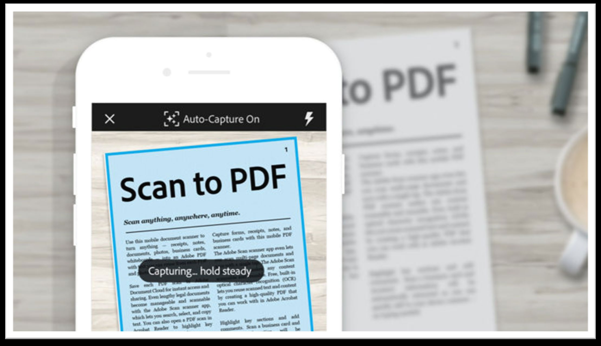

---
*Page 2*
---

## Adobe Creative Cloud for Faculty & Staff

•  Adobe Creative Cloud software is now available for use (at no  additional charge) on all faculty and staff university-owned  computers, labs and classroom devices, and for all students.  •  Please note that this deployment of Adobe software is not  available for use on personally-owned faculty and staff  devices at this time. •  Learn more about  Adobe Creative Cloud for Faculty & Staff 

### •  Adobe Reader  is for viewing, printing, signing, sharing, and  annotating PDFs. Adobe Reader doesn’t have Accessibility  checking tool. Adobe Acrobat DC

--- *Tables Found* ---

### Table 1

| 0   | 1   | 2   |
|:----|:----|:----|
|     |     |     |
|     |     |     |
|     |     |     |

---
*Page 3*
---

## Scanned Documents

•  Screen readers or other assistive technology are  unable to convert images scanned into text. •  Scanned documents, especially poor quality scans  or handwriting, can be difficult to read for  everyone. •  Scanned documents should be  avoided  as much  as possible. •  If the document can be found in the library, a  reference to the library item can be provided. •  Benefits of having digital copy 
•  Can be searched •  Can copy and paste text 

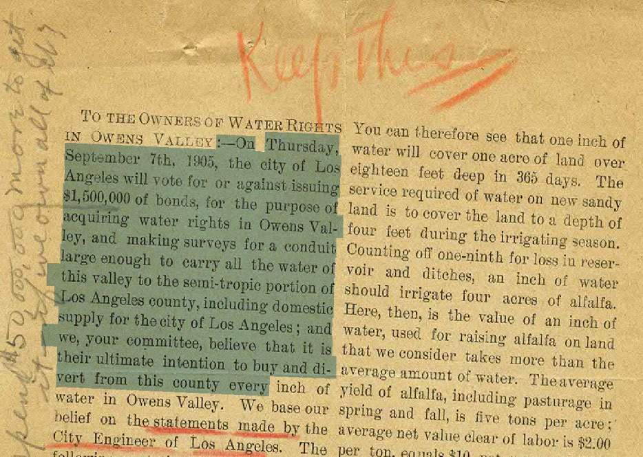

---
*Page 4*
---

## Scanned Documents - OCR

•  Success is highly dependent upon: 
•  The  quality of the scan  depends on the device •  The  quality of the OCR engine •  Some Gotchas 
•  Colored backgrounds •  Handwritten text •  Poor quality scan depends on the device •  After improving the quality of the scan document,  next step is tagging  PDF accessibility markup . 

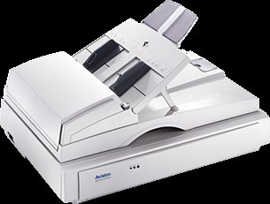

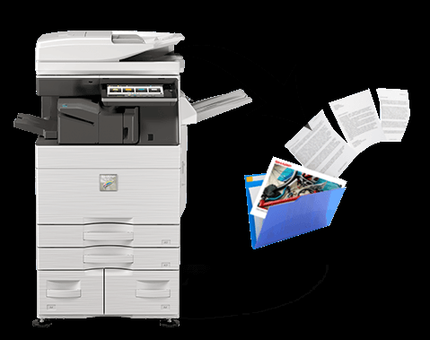

---
*Page 5*
---

## Live or Real Text

•  To check if the text is “live” or “real,” try to select the text with your cursor.  If you’re unable to highlight/select it then it is not real text, and therefore  not accessible  for all users. 
•  Live text  is  searchable ; this allows users to use search functions like  CTRL + F  to look for specific terms and find what they need quickly or to  copy/paste text. 

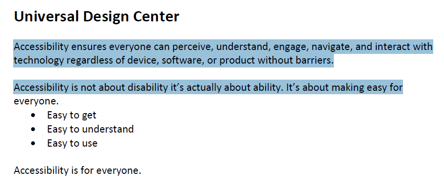

---
*Page 6*
---

## Tools Pane Set Up

If this is your  first time  setting up Adobe Acrobat  software… 
Select  Tools  Tab and Add  Shortcut to the right pane • Accessibility  • Action Wizard • Scan & OCR 

--- *Tables Found* ---

### Table 1

| 0   | 1   | 2   | 3   | 4   | 5   | 6   |
|:----|:----|:----|:----|:----|:----|:----|
|     |     |     |     |     |     |     |
|     |     |     |     |     |     |     |
|     |     |     |     |     |     |     |
|     |     |     |     |     |     |     |
|     |     |     |     |     |     |     |
|     |     |     |     |     |     |     |
|     |     |     |     |     |     |     |
|     |     |     |     |     |     |     |
|     |     |     |     |     |     |     |

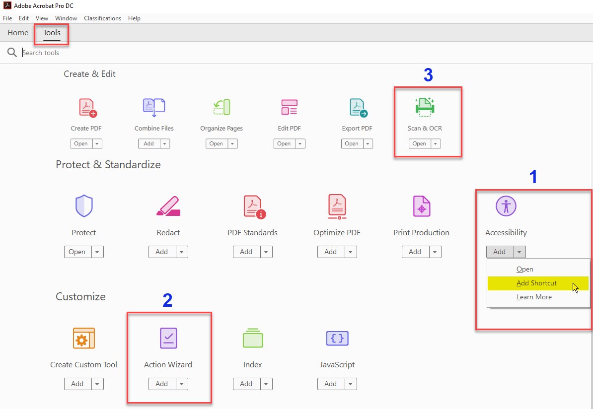

---
*Page 7*
---

## THREE ways to convert scan document to OCR

## Review and Correct Tags Make sure all items have appropriate tags •  Run Initial Accessibility Check

•  Regular Text:  Text/Paragraph •  Headers:  Heading 1 – 6 •  Images:  Figure •  Links:  Link + OBJR •  Form Fields:  Form •  Decorative Content  (e.g. Lines, text boxes,  etc.): Background/Artifact •  Add Document Title and Language •  Verify Reading Order •  Verify Color Contrast •  Run Final Accessibility Check 

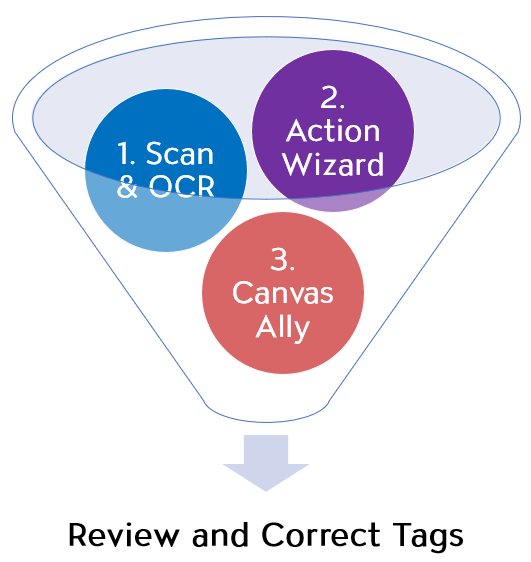

---
*Page 8*
---

## Text Recognition

•  Need to conduct  O ptical  C haracter  R ecognition  (OCR) •  Text Recognition Types: 
o  Searchable Image o  Searchable Image (exact) o  Editable Text and Images 

--- *Tables Found* ---

### Table 1

| 0   | 1   | 2   | 3   | 4   | 5   | 6   | 7   | 8   |
|:----|:----|:----|:----|:----|:----|:----|:----|:----|
|     |     |     |     |     |     |     |     |     |
|     |     |     |     |     |     |     |     |     |
|     |     |     |     |     |     |     |     |     |
|     |     |     |     |     |     |     |     |     |
|     |     |     |     |     |     |     |     |     |
|     |     |     |     |     |     |     |     |     |
|     |     |     |     |     |     |     |     |     |
|     |     |     |     |     |     |     |     |     |
|     |     |     |     |     |     |     |     |     |
|     |     |     |     |     |     |     |     |     |

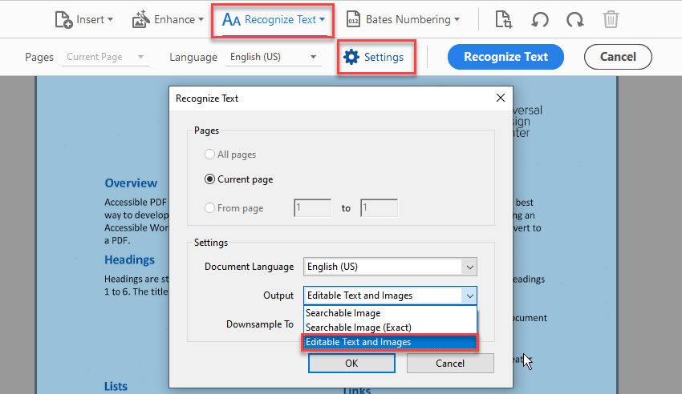

---
*Page 9*
---

## Option 1:  Scan & OCR Steps, 1 of 2

1.  Open Scanned PDF 
2.  Run  Scan & OCR  Tool 
3.  Enhance  “Scanned Document” (Recognize Text Checked) 
4.  Multiple runs of  Enhance  to improve the quality of the scan 

--- *Tables Found* ---

### Table 1

| 0   | 1   | 2   | 3   | 4   |
|:----|:----|:----|:----|:----|
|     |     |     |     |     |
|     |     |     |     |     |
|     |     |     |     |     |
|     |     |     |     |     |
|     |     |     |     |     |
|     |     |     |     |     |

### Table 2

| 0   |
|:----|
|     |
|     |
|     |

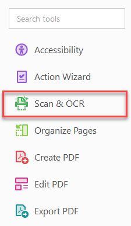

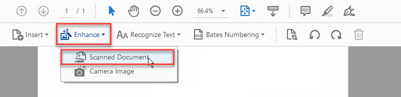

---
*Page 10*
---

## Scan & OCR Steps, 2 of 2

## Now  Live text  should be  searchable ; this allows users to  use search functions like  CTRL + F  to look for specific terms and find  what they need quickly or to  copy/paste text.

--- *Tables Found* ---

### Table 1

| 0   | 1   | 2   | 3   | 4   | 5   | 6   | 7   |
|:----|:----|:----|:----|:----|:----|:----|:----|
|     |     |     |     |     |     |     |     |
|     |     |     |     |     |     |     |     |
|     |     |     |     |     |     |     |     |
|     |     |     |     |     |     |     |     |
|     |     |     |     |     |     |     |     |
|     |     |     |     |     |     |     |     |
|     |     |     |     |     |     |     |     |
|     |     |     |     |     |     |     |     |
|     |     |     |     |     |     |     |     |
|     |     |     |     |     |     |     |     |

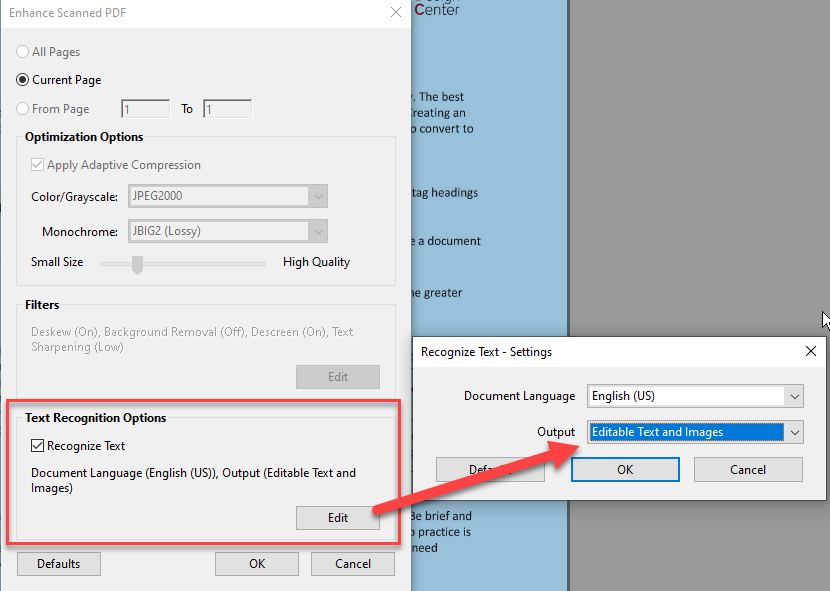

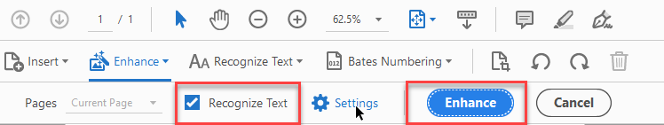

---
*Page 11*
---

## Scan & OCR Steps - Tagging Phase: Autotag Document

## Review and Correct Tags

Make sure all items have appropriate tags •  Run Initial Accessibility Check 
•  Regular Text:  Text/Paragraph •  Headers:  Heading 1 – 6 •  Images:  Figure •  Links:  Link + OBJR •  Form Fields:  Form •  Decorative Content  (e.g. Lines, text boxes,  etc.): Background/Artifact •  Add Document Title and Language •  Verify Reading Order •  Verify Color Contrast •  Run Final Accessibility Check 

--- *Tables Found* ---

### Table 1

| 0   | 1   |
|:----|:----|
|     |     |
|     |     |
|     |     |

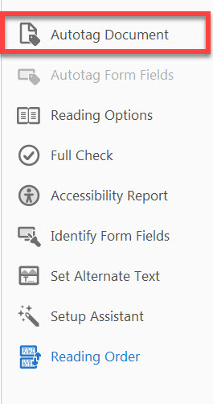

---
*Page 12*
---

## Option 2:   Action Wizard Steps, 1 of 5

•  The  Make Accessible  feature of the Action Wizard is  designed to crawl through a PDF to detect headings,  images, tags, reading order, etc.  •  The easy prompts will guide a user through the  process of making the PDF accessible.  •  It  should not  be the only tool used to check a PDF's  accessibility. User still need to go through  Full Check  for accessibility mark up. 
Step 1:  Open Scanned Document Step 2:  Select  Action Wizard  Tool Step 3:  Select  Make Accessible Step 4:  Start  button 

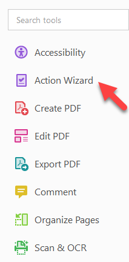

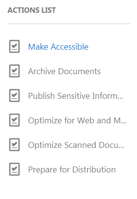

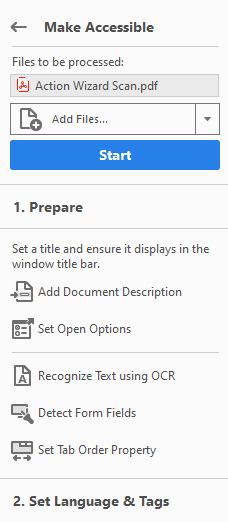

---
*Page 13*
---

## Action Wizard Steps, 2 of 5

Step 5:  The document description gives the document a  proper title to be recognized by assistive technology.  Uncheck the  Leave As Is  box and provide a title to the  document. 
Step 6:  The recognized text option will scan the document  using the selected language. Select the desired  Language  and  Output  Editable Text and Images. 

--- *Tables Found* ---

### Table 1

| 0   | 1   | 2   | 3   |
|:----|:----|:----|:----|
|     |     |     |     |
|     |     |     |     |
|     |     |     |     |
|     |     |     |     |
|     |     |     |     |
|     |     |     |     |
|     |     |     |     |
|     |     |     |     |
|     |     |     |     |
|     |     |     |     |

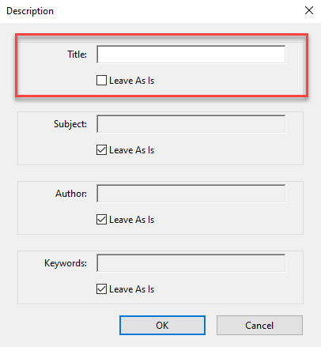

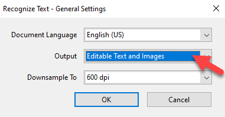

---
*Page 14*
---

## Action Wizard, 3 of 5

Step 7:  Detect Form Fields. The Wizard will automatically detect form fields on the  PDF. If the document has space boxes for form fields, select  Yes, Detect Form  Fields . If not, select  No, Skip this Step . 
Step 8:  Click the desired  Reading  Language  and select  OK . 
Step 9:  The Action Wizard can be set up to always  detect for any image present in the document.  Select  OK  to scan the PDF for missing alternate  texts. 

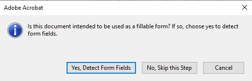

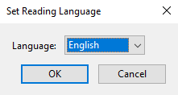

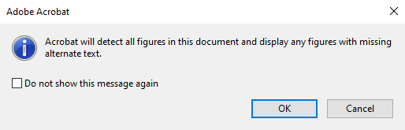

---
*Page 15*
---

## Action Wizard, 4 of 5

Step 10:  If alternative text is missing, a  window will appear to set the  alternative text for each image. Type  the description of each image in the box  and toggle between images using the  right and left arrow buttons. Select  Save  & Close  when all images have proper  descriptions. 
Step 11:  Run Accessibility Full Check.  The  Accessibility Full Checker will run a full scan for  accessibility. Select  Start Checking  to complete  the scan. The results will display on the screen. 

--- *Tables Found* ---

### Table 1

| 0   | 1   | 2   |
|:----|:----|:----|
|     |     |     |
|     |     |     |
|     |     |     |

### Table 2

| 0   | 1   | 2   |
|:----|:----|:----|
|     |     |     |
|     |     |     |
|     |     |     |
|     |     |     |
|     |     |     |

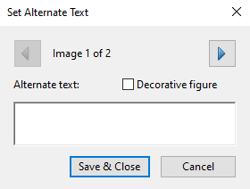

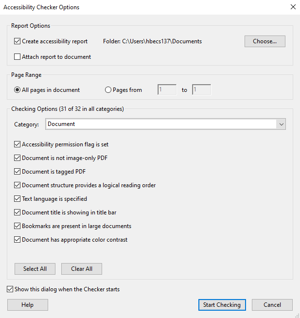

---
*Page 16*
---

## Action Wizard, 5 of 5

Step 12:  Accessibility Issues 
After running the final step in the  Action  Wizard  with the  Accessibility Checker ,  the results are prompted on screen for  review. The  Accessibility Checker  will  detect and prompt any remaining issues.  These issues are identified using specific  icons to represent each type of  issue:  Passed  (green check mark),  Needs  Manual Check  (question mark),  and  Failed  (X). 
•  Important:  any issue with a  Needs Manual  Check  or  Failed  will need to be fixed before the  document can be considered accessible. 
•  Select the  X  in the right-hand pane to close  the  Action Wizard. 

## Review and Correct Tags

Make sure all items have 
appropriate tags •  Run Initial Accessibility Check 
•  Regular Text:  Text/Paragraph •  Headers:  Heading 1 – 6 •  Images:  Figure •  Links:  Link + OBJR •  Form Fields:  Form •  Decorative Content  (e.g. Lines, text  boxes, etc.): Background/Artifact •  Add Document Title and Language •  Verify Reading Order •  Verify Color Contrast •  Run Final Accessibility Check 

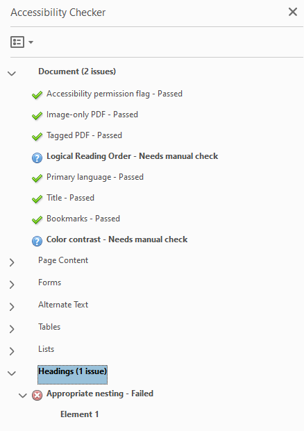

---
*Page 17*
---

## Option 3:  Canvas Ally Course Steps, 1 of 2

Upload your image scanned  document (without OCR) in  Canvas Ally Course  Files  folder 
Select three vertical dots icon menu Select  Alternative Formats 

--- *Tables Found* ---

### Table 1

| 0   | 1   |
|:----|:----|
|     |     |

### Table 2

| 0   | 1   | 2   | 3   |
|:----|:----|:----|:----|
|     |     |     |     |
|     |     |     |     |
|     |     |     |     |
|     |     |     |     |
|     |     |     |     |

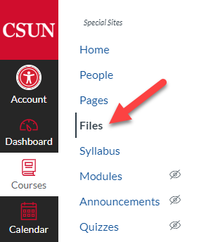

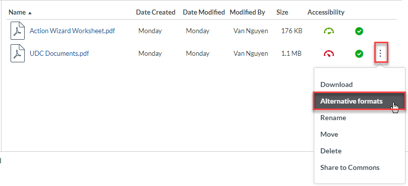

---
*Page 18*
---

## Canvas Ally Course Steps, 2 of 2

## Ally Attempts To

•  Improve the quality of the scan •  OCRed PDF with Searchable Text •  Tag it 
Review and Correct Tags 
Make sure all items have appropriate tags 
•  Run Initial Accessibility Check 
•  Regular Text:  Text/Paragraph •  Headers:  Heading 1 – 6 •  Images:  Figure •  Links:  Link + OBJR •  Form Fields:  Form •  Decorative Content  (e.g. Lines, text  boxes, etc.): Background/Artifact •  Add Document Title and Language •  Verify Reading Order •  Verify Color Contrast •  Run Final Accessibility Check 

--- *Tables Found* ---

### Table 1

| 0   | 1   | 2   |
|:----|:----|:----|
|     |     |     |
|     |     |     |
|     |     |     |

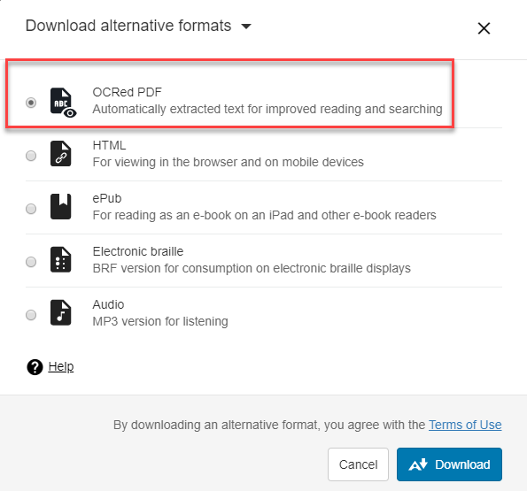

---
*Page 19*
---

## Canvas Ally Course - Scanned Comparison

Original Quality – No tags available Ally Quality – Improved and tags 

--- *Tables Found* ---

### Table 1

| 0   | 1   | 2   |
|:----|:----|:----|
|     |     |     |
|     |     |     |
|     |     |     |

### Table 2

| 0   | 1   | 2   | 3   | 4   | 5   |
|:----|:----|:----|:----|:----|:----|
|     |     |     |     |     |     |
|     |     |     |     |     |     |
|     |     |     |     |     |     |
|     |     |     |     |     |     |

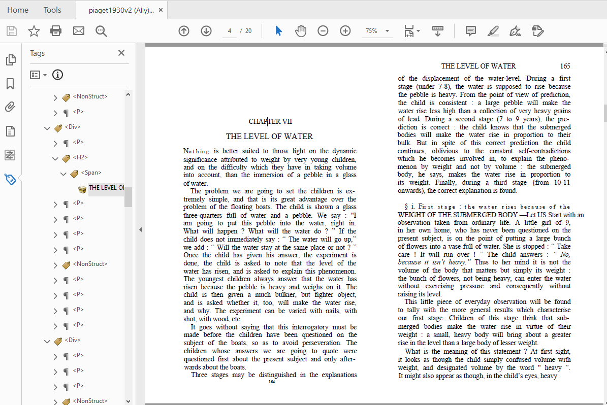

---
*Page 20*
---

## Adobe Scan on Mobile App

•  Free  Adobe Scan  on iOS or  Android  •  Scans Documents into PDFs •  Automatically Recognizes Text 
•  See  Adobe Scan Mobile App in action 

--- *Tables Found* ---

### Table 1

| 0   | 1   | 2   | 3   | 4   | 5   | 6   | 7   |
|:----|:----|:----|:----|:----|:----|:----|:----|
|     |     |     |     |     |     |     |     |
|     |     |     |     |     |     |     |     |
|     |     |     |     |     |     |     |     |
|     |     |     |     |     |     |     |     |
|     |     |     |     |     |     |     |     |
|     |     |     |     |     |     |     |     |

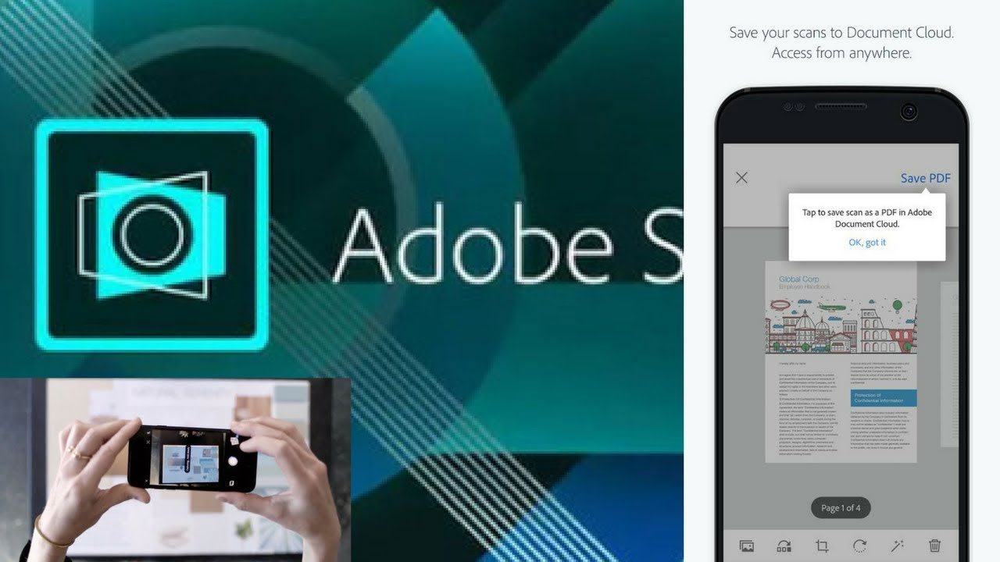

---
*Page 21*
---

## Option 1:  No Source Document? Try Export Options

When no source document is available,  recommend opening the PDF in Acrobat, and  exporting to a Word or PowerPoint file. 
To convert a PDF to a Word document, select  File > Export To> Microsoft Word > Word  Document . 
Next step is applying  Styles Formatting . See  the next slide “Direct vs Styles Formatting.” 
Note:  Need to verify format, alignment,  unrecognized characters, punctuation,  spelling, etc. 

--- *Tables Found* ---

### Table 1

| 0   | 1   | 2   | 3   |
|:----|:----|:----|:----|
|     |     |     |     |
|     |     |     |     |
|     |     |     |     |
|     |     |     |     |
|     |     |     |     |
|     |     |     |     |
|     |     |     |     |
|     |     |     |     |

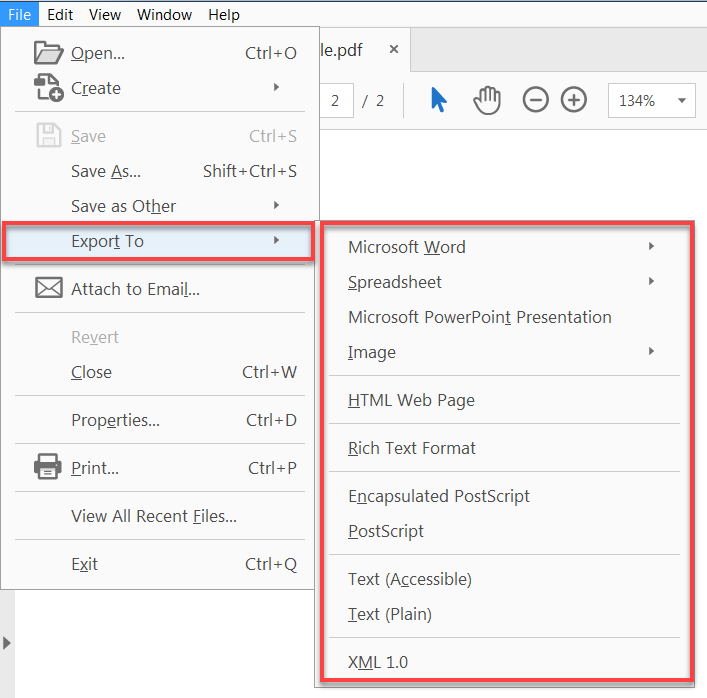

---
*Page 22*
---

## Direct vs Styles Formatting

Direct Formatting 
•  Not accessible to any assistive  technology such as screen readers •  Can’t create a Table of Contents •  Can’t create a navigation to different  sections in a document •  Huge barriers! 
Styles Pane Formatting •  Provide structure and make document accessible •  Easier to modify existing formatting •  Create and update a Table of Contents •  Quicker navigation to different sections in a document •  Retain document structure when export to PDF •  Accessible to any assistive technology like screen  readers •  Save time and save lives! 

--- *Tables Found* ---

### Table 1

| 0   | 1   |
|:----|:----|
|     |     |
|     |     |
|     |     |

### Table 2

| 0   | 1   | 2   | 3   | 4   |
|:----|:----|:----|:----|:----|
|     |     |     |     |     |
|     |     |     |     |     |
|     |     |     |     |     |
|     |     |     |     |     |

### Table 3

| 0   | 1   | 2   |
|:----|:----|:----|
|     |     |     |
|     |     |     |
|     |     |     |

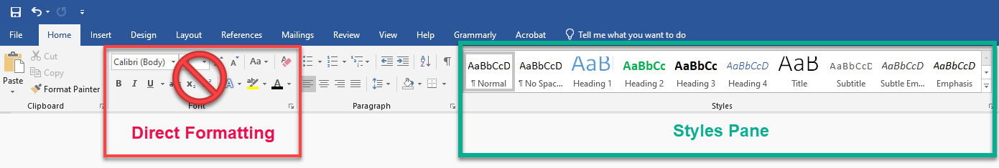

---
*Page 23*
---

## Headings and  Document Structure

Example 1:  Reading long, dense text  documents can be a daunting task for  learners 
Example 2:  Well-structured documents help readers  organize and process texts 

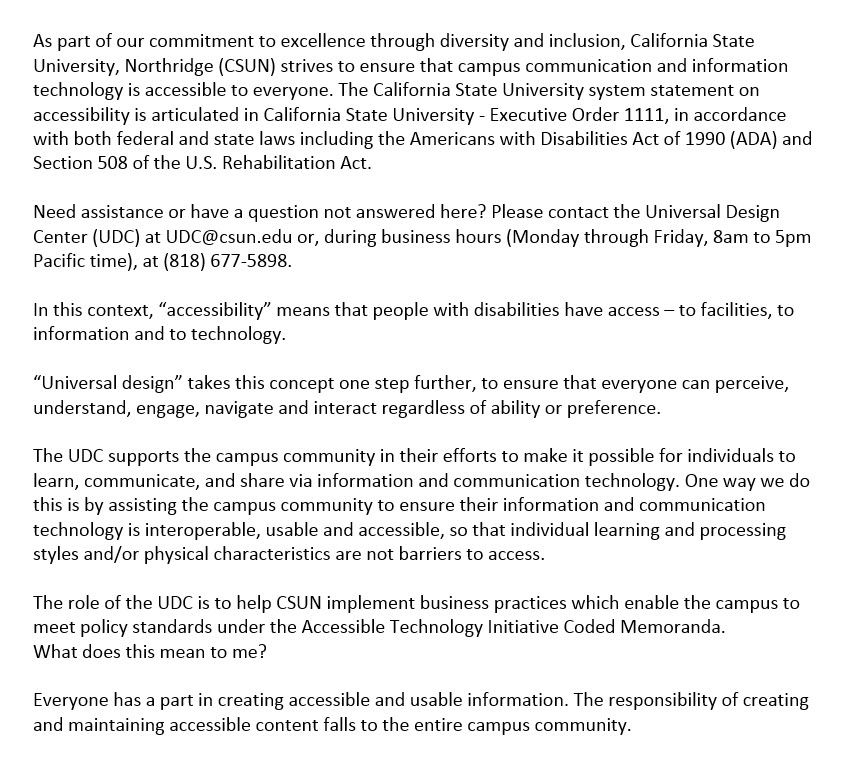

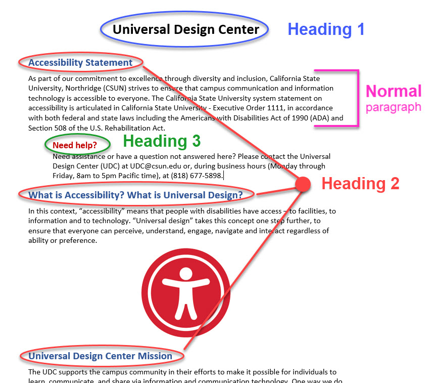

---
*Page 24*
---

## Heading Styles •  Heading Styles (Heading 1 through Heading 6) in a logical sequence. Do not  skip heading levels i.e. Heading 2 to Heading 4, headings should be in order.) •  Heading 1:  Document title or main content heading/title  (just one) •  Heading 2:  Major section heading •  Heading 3:  Sub-section of the Heading 2 •  Heading 4:  Sub-section of the Heading 3, and so on, ending with  Heading 6 •  Normal:  Text or paragraph •  Title  in Word Style won't recognize when converting to a PDF. Start  with  Heading 1  for the document title.

•  How to create an accessible document using Microsoft Word, visit Word  Essentials page  www.csun.edu/udc/word 
Headings  are styles to  give a document structure  by category or topic. 
Without headings , a  person using assistive  technology like a screen  reader  cannot  navigate by  sections, subsections, or  scan section titles to  understand the document  structure. 

--- *Tables Found* ---

### Table 1

| 0   | 1   | 2   | 3   |
|:----|:----|:----|:----|
|     |     |     |     |
|     |     |     |     |
|     |     |     |     |
|     |     |     |     |
|     |     |     |     |
|     |     |     |     |
|     |     |     |     |

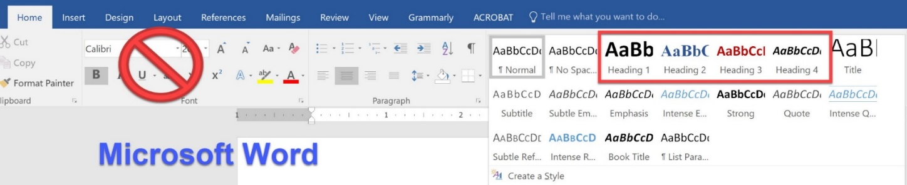

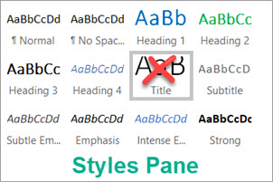

---
*Page 25*
---

## Option 2:  Edit Original PDF Documents

•  Allows you to add and edit text and content within your PDF •  Benefits 
o  Saves Time  o  Helpful if you converted from inaccessible files  •  Drawback 
o  If you have extensive edits, may need to retag your document. 

---
*Page 26*
---

*(This page was processed with OCR)*
Review PDF Tools Training

niversal ~esign — enter csun.edu/ude

---
*Page 27*
---

## What is a Tagged PDF? TAGS  are the HTML code  accessibility markup all of  the document text, images,  etc. Tags are invisible  identifiers that will tell  screen readers and other  assistive technology  (AT)  an element is…

•  header <H1-H6> 
•  paragraph 
 
•  image <Figure> 
•  list item <LI> 
•  hyperlink <Link> 
•  table data cell <TD> 

--- *Tables Found* ---

### Table 1

| 0   | 1   | 2   | 3   | 4   | 5   | 6   | 7   |
|:----|:----|:----|:----|:----|:----|:----|:----|
|     |     |     |     |     |     |     |     |
|     |     |     |     |     |     |     |     |
|     |     |     |     |     |     |     |     |
|     |     |     |     |     |     |     |     |
|     |     |     |     |     |     |     |     |
|     |     |     |     |     |     |     |     |
|     |     |     |     |     |     |     |     |

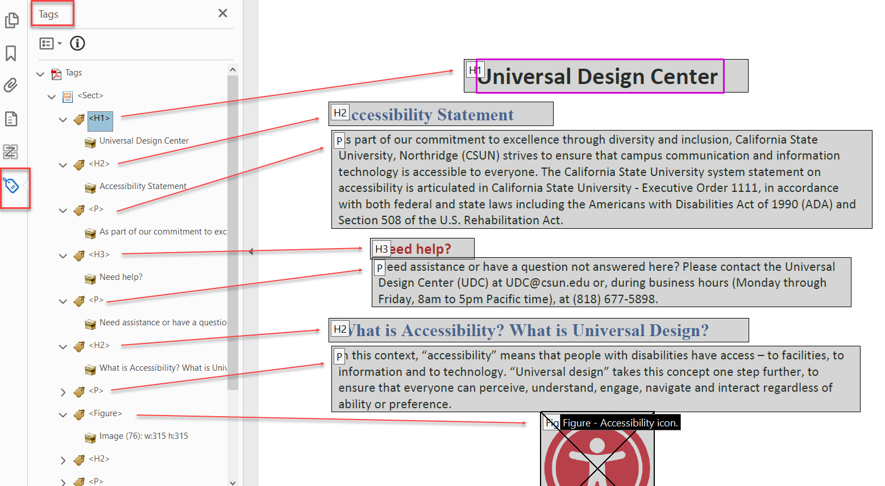

---
*Page 28*
---

## Adding Tools to Navigation Pane These are the primary tools needed to create an accessible PDF:

Option 1:  View > Show/Hide >Navigation >  Tags and Content  Pane 
Option 2:  On left pane, right-click to select  Tags and Content  Pane 

--- *Tables Found* ---

### Table 1

| 0   | 1   | 2   | 3   | 4   | 5   |
|:----|:----|:----|:----|:----|:----|
|     |     |     |     |     |     |
|     |     |     |     |     |     |
|     |     |     |     |     |     |
|     |     |     |     |     |     |
|     |     |     |     |     |     |
|     |     |     |     |     |     |
|     |     |     |     |     |     |
|     |     |     |     |     |     |

### Table 2

| 0   | 1   | 2   | 3   |
|:----|:----|:----|:----|
|     |     |     |     |
|     |     |     |     |
|     |     |     |     |
|     |     |     |     |
|     |     |     |     |
|     |     |     |     |

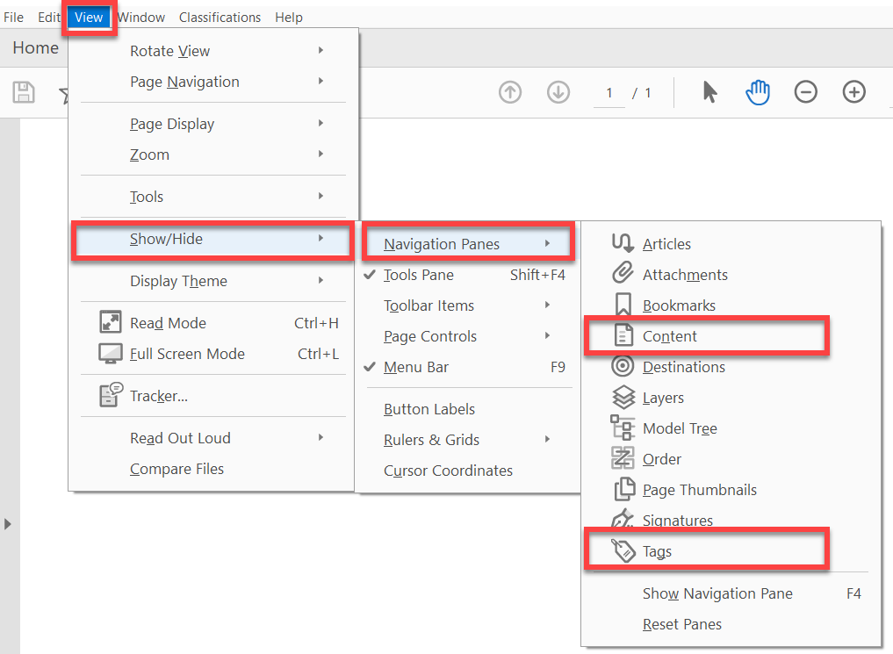

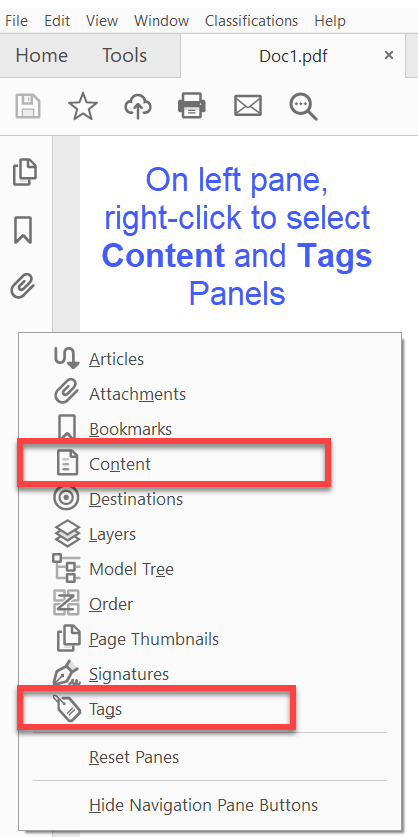

---
*Page 29*
---

## Tags Pane, 1 of 2

Accessible PDF means  every piece of content  must be  tagged with the correct tag. 

## Tags are invisible identifiers that will tell  screen readers and  other assistive technology  (AT) an object is…

•  Paragraphs of body text: 
 •  Headings and subheads: <H1> - <H6> •  Lists: <L>, <LI> •  Tables: <Table>, <TR>, <TH>, <TD> •  Graphics have Alt-Text that describe the visual: <Figure> •  Hyperlinks: <Link> •  Captions, and other parts of a document: <Caption> •  Decorative images: <Artifact> 
Ensure the tags are in the correct  logical reading order  to match the  document pane. 

--- *Tables Found* ---

### Table 1

| 0   | 1   | 2   |
|:----|:----|:----|
|     |     |     |
|     |     |     |

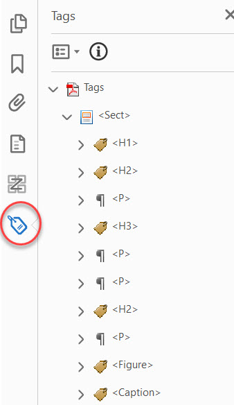

---
*Page 30*
---

## Tags Pane, 2 of 2

Tags are shown as an  expandable “tree” 
•  Up and Down arrow keys to  navigate tags tree. •  Right and left arrow keys to  expand and collapse the text. 

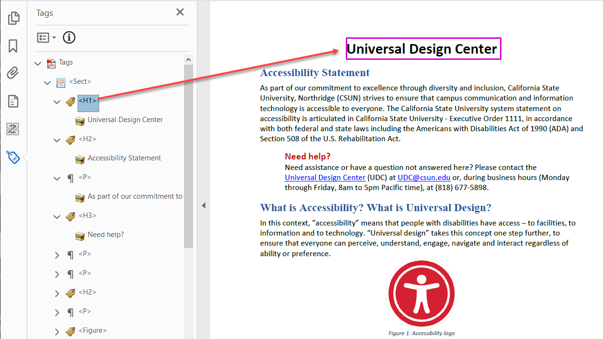

---
*Page 31*
---

## Check Accessibility  First run the Accessibility  Full Check  at the beginning and at the end.

•  Accessibility checkers  results in bold text have  one or more issues/failed  that need to fix. 
•  If you have a failure, you  can right-click on any  item in the report and  select “Explain” that will  link to Adobe webpage to  explain the problem. 
•  If the results not in bold  text, that section has  passed. 

--- *Tables Found* ---

### Table 1

| 0   |
|:----|
|     |
|     |
|     |

### Table 2

| 0   | 1   | 2   |
|:----|:----|:----|
|     |     |     |
|     |     |     |
|     |     |     |

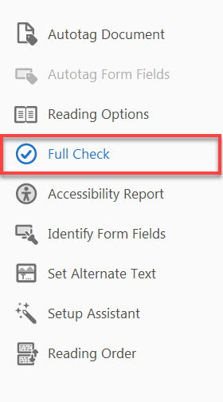

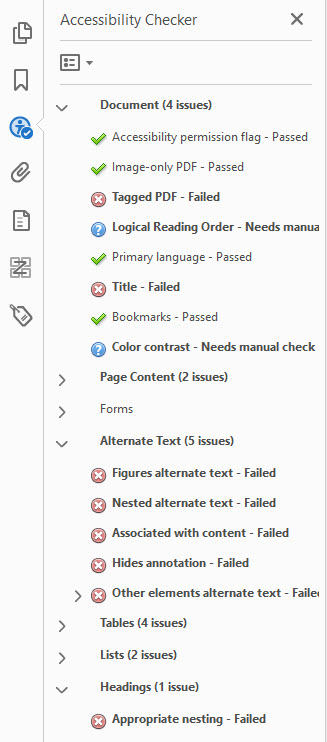

---
*Page 32*
---

## Common Issues – Title shown as a failure

Acrobat did not recognize the Title from  Word Document, simply right-click Title item  and select “Fix”. 
The document description gives the  document a proper title and language to be  recognized by assistive technology. 
•  Select File  menu  > Properties 
•  Description  tab, enter  Title  box is  document title or main content  heading/title (deselect  Leave As Is , if  necessary). 
•  Application  box showing the source  document created from Word to PDF. 

--- *Tables Found* ---

### Table 1

| 0   | 1   | 2   | 3   |
|:----|:----|:----|:----|
|     |     |     |     |
|     |     |     |     |
|     |     |     |     |
|     |     |     |     |

### Table 2

| 0   | 1   | 2   |
|:----|:----|:----|
|     |     |     |
|     |     |     |

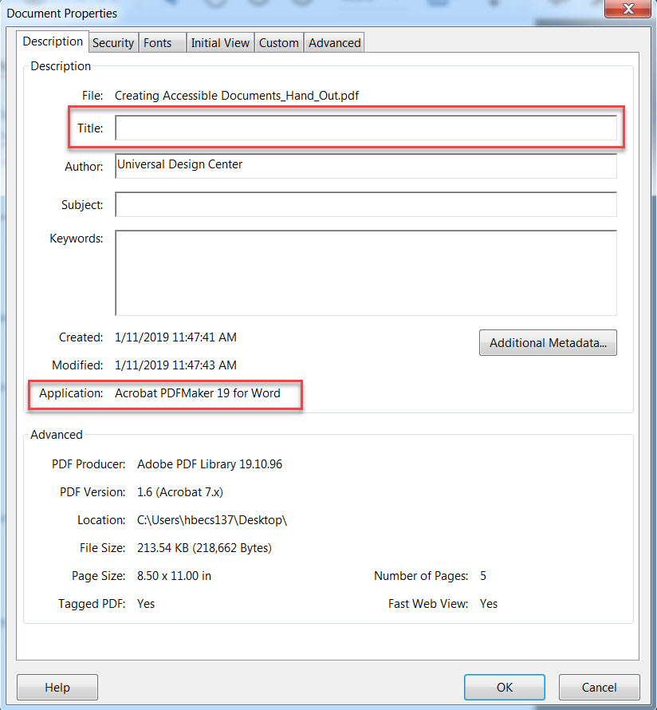

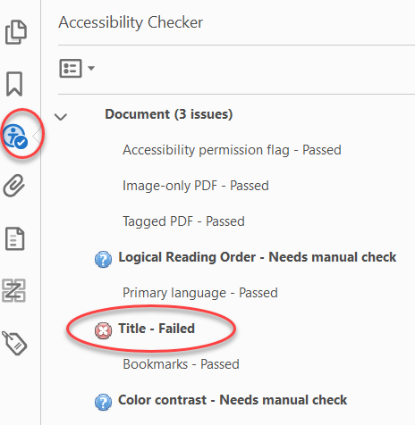

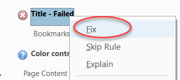

---
*Page 33*
---

## What are PDF Title and Language?

## Title

•  A PDF title is a more descriptive and  meaningful version of the file name. PDF  titles are often visible in the PDF window or  tab. This visibility makes it easier to  distinguish multiple PDFs before diving in. •  When multiple PDFs are open, well defined  PDF titles allow for easier distinction  between them. This distinction is particularly  useful when relying on screen readers. 

## Language

Screen readers can "speak" various  languages—as long the content  language is identified. If the screen  reader does not support or cannot  speak the defined language, the user  might be informed of the content  language, even if that content cannot  be properly read. 
WebAIM: Document and Content Language 

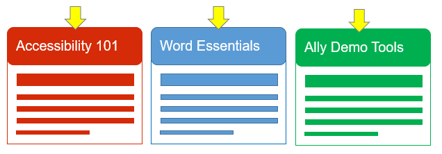

---
*Page 34*
---

## Accessibility Checker – Manual evaluation

The accessibility checker will always flag  two items that require manual evaluation: 
•  Logical Reading Order •  Color Contrast 
Two question marks       will always stay in  Document (2 issues)  section even if you  right-click and select  Pass . It just there as a  reminder to conduct manual check. 

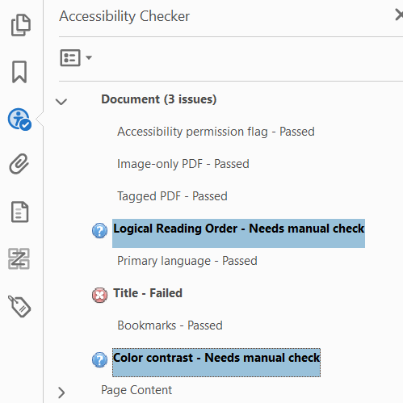

---
*Page 35*
---

## Verify Logical Reading Order

Ensure the  TAGS Tree  are in the  correct logical order  to match the document pane. Manual rearrange tags as  needed in the  TAGS pane . After making these adjustments, start from the top of the tags tree and move  through the tags pane sequentially using the down arrow key. A logical reading order start from left to right,  top to bottom as illustrated. The Document Pane example is a two-columns layout hence the logical reading  order starts with the first column then second column. 
Left: Incorrect  reading order 
Bottom: Correct  reading order 

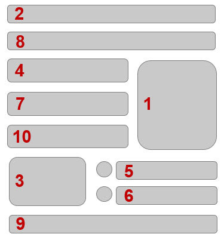

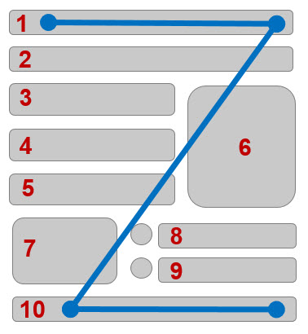

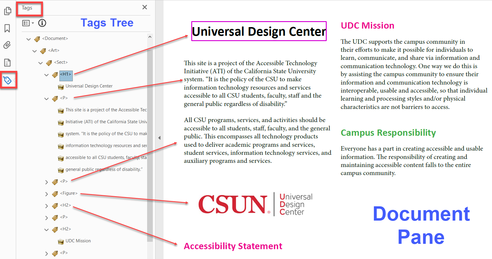

---
*Page 36*
---

## Verify Color Contrast

People who have low vision or  colorblind could encounter some  difficulty distinguishing text color  from a background color if the  contrast is insufficient contrast ratio  1.5:1. 
This example has a great color  contrast ratio of 8.7:1. The  contrast is sufficient for those  who have color deficiencies 
•  Download  Colour Contrast Analyser  onto  your computer (PC/Mac) to ensure  accessible contrast or use an online  contrast checker from  WebAIM . •  WCAG Level AA requires a contrast ratio of  at least  4.5:1  for regular sized text (12 or  14 pt. font) and  3:1  for large text (18 pt.  font). •  Coblis Color Blindness Simulator 

--- *Tables Found* ---

### Table 1

| 0   | 1   |
|:----|:----|
|     |     |
|     |     |
|     |     |
|     |     |
|     |     |
|     |     |

### Table 2

| 0   | 1   | 2   | 3   |
|:----|:----|:----|:----|
|     |     |     |     |
|     |     |     |     |
|     |     |     |     |
|     |     |     |     |
|     |     |     |     |
|     |     |     |     |
|     |     |     |     |
|     |     |     |     |

### Table 3

| 0   |
|:----|
|     |
|     |
|     |
|     |
|     |

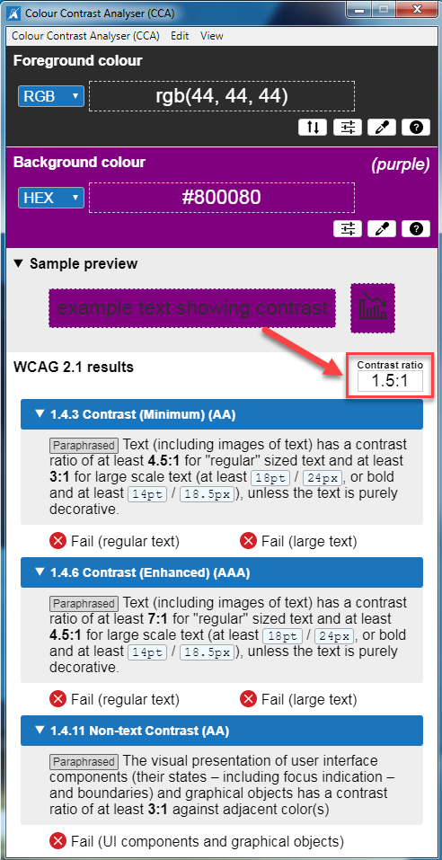

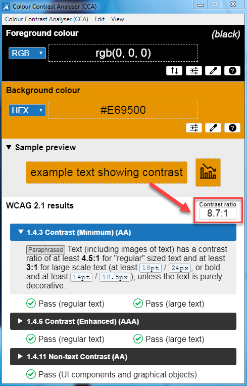

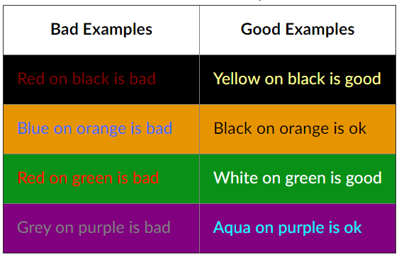

---
*Page 37*
---

## Check Accessibility Again…

• Go through each section that has one or more issues/failed to fix it until all sections passed. 
• Two question marks       will always stay in  Document (2 issues)  section even if you right-click and  select  Pass . It just there as a reminder to conduct manual check. 

--- *Tables Found* ---

### Table 1

| 0   |
|:----|
|     |
|     |
|     |

### Table 2

| 0   | 1   | 2   |
|:----|:----|:----|
|     |     |     |
|     |     |     |
|     |     |     |

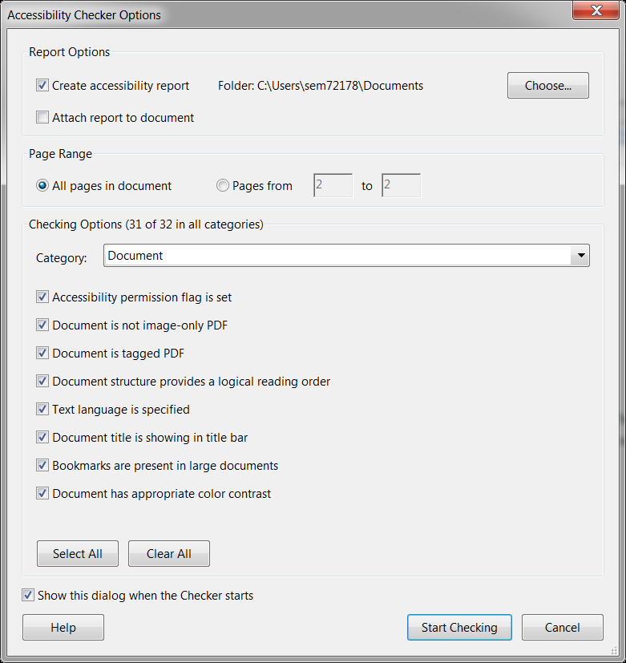

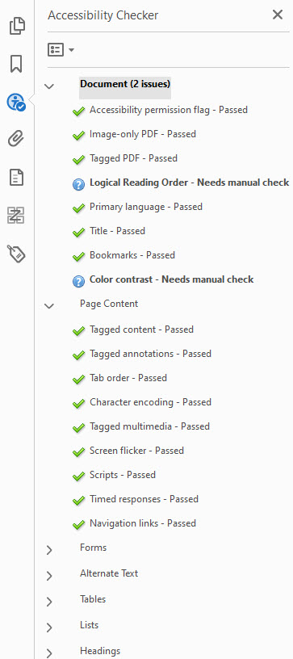

---
*Page 38*
---

## No Tags Available

If you see “No tags available” in the Tags Pane, then the document is  missing tagged structure. See the next slide “How to tag a document?” 

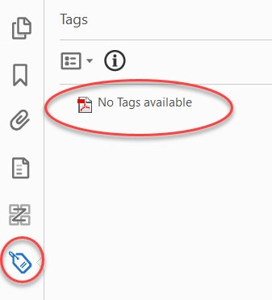

---
*Page 39*
---

## How to Tag a Document?

1. Open  Accessibility , select  Reading Order  Tool 2. Draw a rectangle around the content or double-click the content  3. Select one of Reading Order buttons to tag it 4. Proceed step #2 to tag the rest of the content 

--- *Tables Found* ---

### Table 1

| 0   | 1   | 2   | 3   | 4   |
|:----|:----|:----|:----|:----|
|     |     |     |     |     |
|     |     |     |     |     |
|     |     |     |     |     |
|     |     |     |     |     |
|     |     |     |     |     |

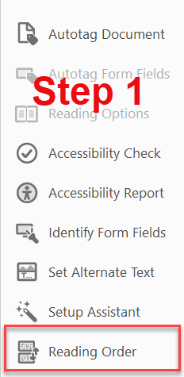

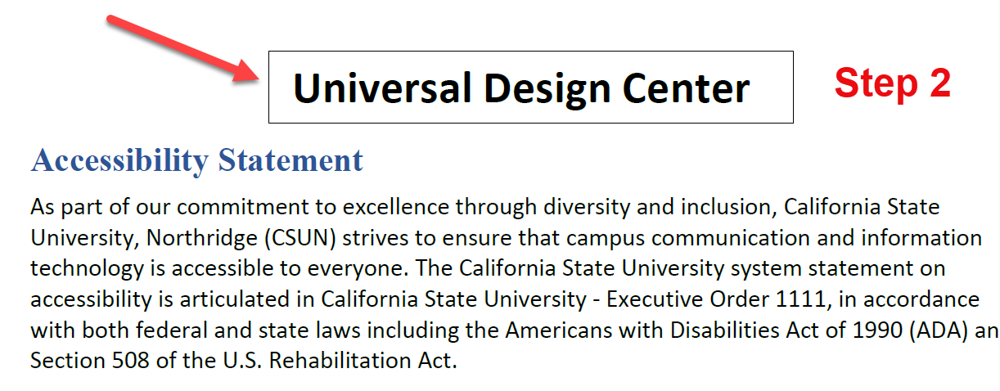

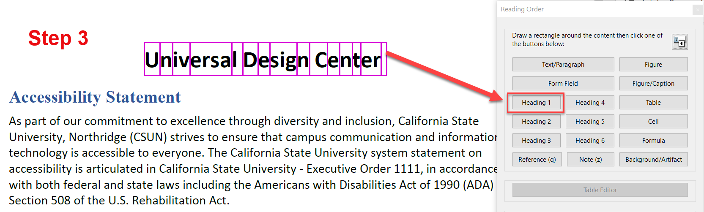

---
*Page 40*
---

Heading Tags Sample 
Content highlighted from tags tree 
For multiple tags selection, CTRL + select tags (PC) or Command + select tags (Mac) 

--- *Tables Found* ---

### Table 1

| 0   | 1   | 2   | 3   | 4   |
|:----|:----|:----|:----|:----|
|     |     |     |     |     |
|     |     |     |     |     |
|     |     |     |     |     |
|     |     |     |     |     |

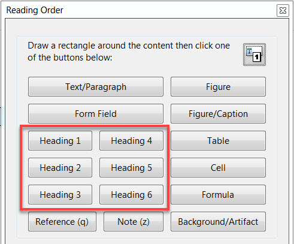

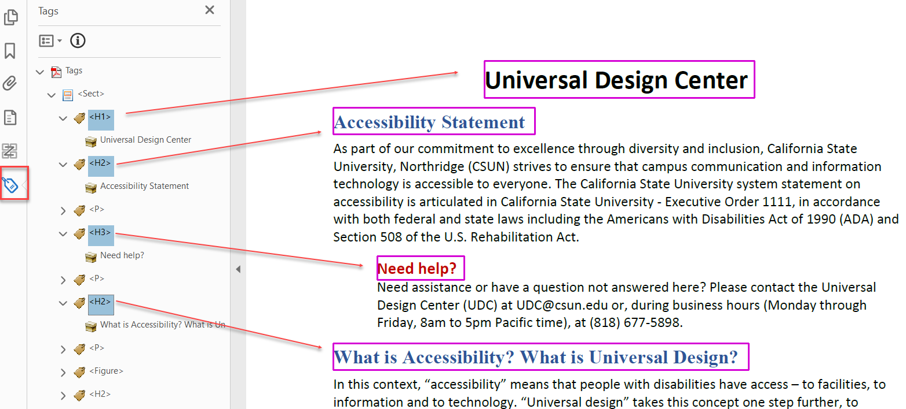

---
*Page 41*
---

*(This page was processed with OCR)*
Paragraph Tags Sample

Reading Order

i Tags
El- @
v fa Tags

Vv By <Sect>

Draw a rectangle around the content then click one

of the buttons below:

Text/Paragraph Figure

Form Field Figure/Caption

Heading 1 Heading 4 Table
Heading 2 Heading 5 Cell

Heading 3 | Heading 6 Formula

Universal Design Center

> @ “HP Accessibility Statement

As part of our commitment to excellence through diversity and inclusion, California State
/ niversity, Northridge (CSUN) strives to ensure that campus communication and information
jay As part of our commitment to ex echnology is accessible to everyone. The California State University system statement on

> ¢ <H3>

accessibility is articulated in California State University - Executive Order 1111, in accordance
ith both federal and state laws including the Americans with Disabilities Act of 1990 (ADA) and
> @
 @ <H2>
; Need help?
> eg” Need assistance or have a question not answered here? Please contact the Universal
> @ <Figure> Design Center (UDC) at UDC@csun.edu or, during business hours (Monday through
> @ <H2> Friday, 8am to 5pm Pacific time), at (818) 677-5898.

Reference (q) | | Note (z) Background/Artifact

Content highlighted from tags tree

niversal ~ esign —enter csun.edu/udc

--- *Tables Found* ---

### Table 1

| 0   | 1   | 2   |
|:----|:----|:----|
|     |     |     |
|     |     |     |
|     |     |     |

### Table 2

| 0   | 1   | 2   |
|:----|:----|:----|
|     |     |     |
|     |     |     |

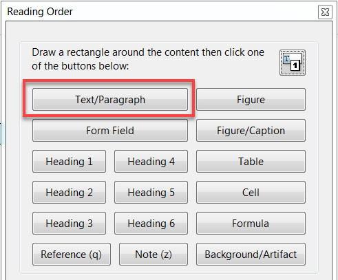

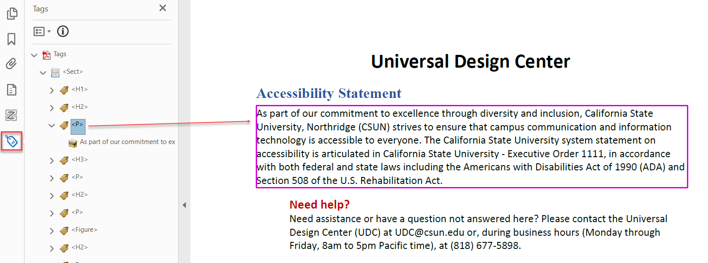

---
*Page 42*
---

*(This page was processed with OCR)*
List Tags Sample

w @ <b> 4

wa G <Ll> *
How to create an accessible PDF:

wv ¢ <LBody>
1. Create an accessible Word document

— | |. Create an accessible Word docums
eed 2. Convert your Word document to PDF

| 3. Validate PDF Tags and Reading Order
 @ <LBody> 4. Use the accessibility checker to test your document
ia 2. Convert your Word document to P'
v @ «i>
> @ <LBody>
v @ «i>
> @ <LBody>

niversal ~esign — enter csun.edu/ude

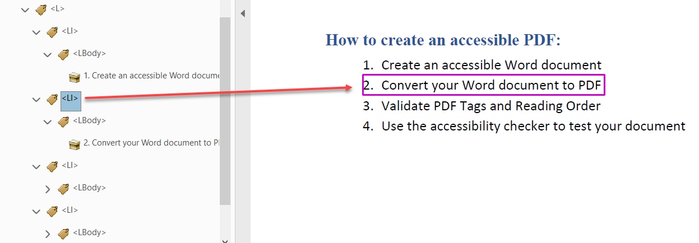

---
*Page 43*
---

*(This page was processed with OCR)*
Link Tags Sample

Jc s OL CO = O CxXcCelle = OUE OIVver®n: Ve . U ITT, .

> G <> University, Northridge (CSUN) strives to ensure that campus communication and information
vw @ 
 technology is accessible to everyone. The California State University system statement on
-\esdlastornees ise qneten eee accessibility is articulated in California State University - Executive Order 1111, in accordance
with both federal and state laws including the Americans with Disabilities Act of 1990 (ADA) and

w @§ 
 Section 508 of the U.S. Rehabilitation Act.

v G sine Need help?

gy Universal Design Center Need assistance or have a question not answered here? Please contact the

—— ied Universal Design Center\((UDC) at UDC@csun.edu or, during business hours (Monday

Link - OBJR
gin through Friday, 8am to 5pm Pacific time), at (818) 677-5898.

ey (UDC) at

What is Accessibility? What is Universal Design?

In this context, “accessibility” means that people with disabilities have access — to facilities, to

information and to technology. “Universal design” takes this concept one step further, to

@ Link - OBJR ensure that everyone can perceive, understand, engage, navigate and interact regardless of
ability or preference.

vw @ <Link>

| UDC@csun.edu

niversal ~ esign csun.edu/udc

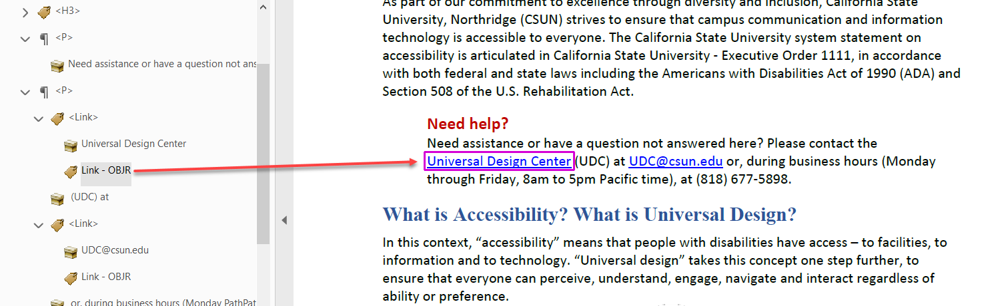

---
*Page 44*
---

*(This page was processed with OCR)*
vw ied <Jable>

amas =| <TR>

> EB

> [i <TH
wv A <TR>
> EE <TD>

> EB <TD>

| Hearing
> <TD>
ww FR <TR>
> EB <TD>
> GB <TD>

> =e <TR>

niversal —~esign

Disability
Visual
Cognitive Mental

Ambulatory

Table Tags Sample

People in U.S.
1.8 Million

1.0 Million

4.3 Million

11.8 Million

How to create an accessible PDF:

1. Create an accessible Word document

csun.edu/udc

--- *Tables Found* ---

### Table 1

| 0   | 1   | 2   | 3   | 4   |
|:----|:----|:----|:----|:----|
|     |     |     |     |     |
|     |     |     |     |     |
|     |     |     |     |     |
|     |     |     |     |     |
|     |     |     |     |     |
|     |     |     |     |     |
|     |     |     |     |     |
|     |     |     |     |     |
|     |     |     |     |     |
|     |     |     |     |     |

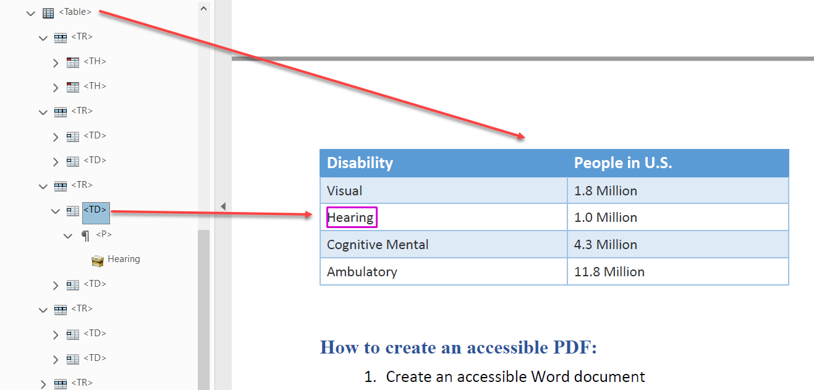

---
*Page 45*
---

## Image Alternative  or Alt Text

Screen readers and other AT announce that it’s  an “image” or “graphic”,  then read the alt text: “Three plants going through transformation  with text quote Accessibility user-friendly  document for CSUN student success.” 
•  The purpose of  Alt Text  is to allow low vision or blind users who  use text-to-speech assistive technologies (AT), such as screen  readers, to understand the purpose of graphic images. Sighted  users usually don’t see alt text unless they use AT. •  Screen readers and other AT  can’t  convert images into texts. So,  when writing alt text, consider the following for images: 
o What is its purpose?  o Is the image important enough to be there? o If there is no description, what will the screen reader users  miss? o Be concise and eliminate unnecessary words. o When completing the alt text, use proper punctuation such as  periods to indicate the end of the alt text. Without proper  punctuation, some screen readers will run the alt text into the  body text that follows and cause confusion to the user. •  “Image of…”, “Photo of…” is not needed because screen readers  and other AT announce that it’s an “image” or “graphic”. •  There is no limit to the number of characters, but keep alt text  descriptions short around 200 characters or less. •  Don’t use images of text for headings instead use live text  (fully  editable or selectable text). 

---
*Page 46*
---

## How to Describe Images?

A stair chase leading up to an entryway is  painted yellow with bold black text that reads  museums are now. 
A hand reaches out of a computer screen giving  the hand gesture for stop. The screen reads  ‘access denied!’ 
On the left is the book cover for Haben The Deafblind  Woman Who Conquered Harvard Law, and on the  right is the quote: “In the Tigrinya language of Eritrea  and Ethiopia, Haben means 'pride.’” 
Michelle Obama claps and Barack waves. Student holds a diploma hardcover up in the air  during CSUN commencement. Caption text "and  together, as Matadors, we will move mountains." 

## More examples of How  to Describe Images

• Document Learning Tools: Describing images 
• How to Describe Images  (Art, Chemistry,  Diagrams, Flow Charts, Formatting & Layout,  Graphs, Maps, Mathematics, Page Layout, Tables,  Text-only images) 
• Periodic Table of the Elements 
• UDC Best Practices for Describing Images 

--- *Tables Found* ---

### Table 1

| 0   | 1   | 2   |
|:----|:----|:----|
|     |     |     |
|     |     |     |

### Table 2

| 0   |
|:----|
|     |

### Table 3

| 0   |
|:----|
|     |

---
*Page 47*
---

## Figure and Caption Tags Sample

•  Images are tagged as “ Figure ” 
•  Or images with short text underneath as “ Figure/Caption ”. 

--- *Tables Found* ---

### Table 1

| 0   | 1   | 2   |
|:----|:----|:----|
|     |     |     |
|     |     |     |
|     |     |     |

### Table 2

| 0   | 1   | 2   | 3   | 4   | 5   | 6   |
|:----|:----|:----|:----|:----|:----|:----|
|     |     |     |     |     |     |     |
|     |     |     |     |     |     |     |
|     |     |     |     |     |     |     |
|     |     |     |     |     |     |     |
|     |     |     |     |     |     |     |
|     |     |     |     |     |     |     |

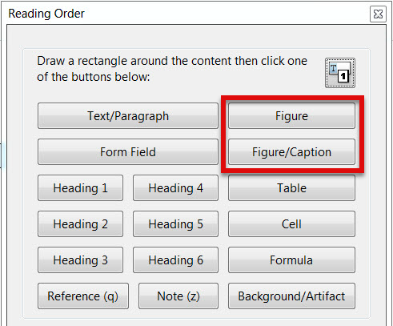

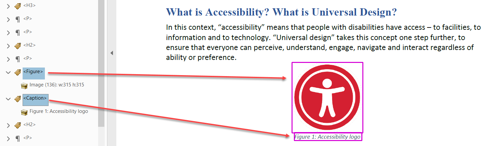

---
*Page 48*
---

## Background/Artifact Tag for Decorative Images

•  Conveys no information; does not provide  meaningful information. •  Purely for visual effect. •  The horizontal line that divided the two sections. •  Line border image used as part of page design. •  Decorative images do not require a text  alternative. •  Decorative images, lines, borders, or shapes  ignore by assistive technologies, such as screen  readers. 

--- *Tables Found* ---

### Table 1

| 0   | 1   | 2   |
|:----|:----|:----|
|     |     |     |
|     |     |     |

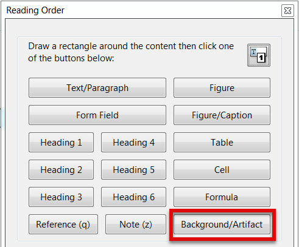

---
*Page 49*
---

## About Reading Order Tool

Show Page Content Groups •  Page content order:  number  refers to the order of the  element in this content. •  Structure types : shows  document’s tag structure. Recommend to uncheck  “Display like elements in a  single block.”  This will show  single tag rather than group  elements. 

--- *Tables Found* ---

### Table 1

| 0   | 1   | 2   | 3   | 4   | 5   | 6   |
|:----|:----|:----|:----|:----|:----|:----|
|     |     |     |     |     |     |     |
|     |     |     |     |     |     |     |
|     |     |     |     |     |     |     |
|     |     |     |     |     |     |     |
|     |     |     |     |     |     |     |
|     |     |     |     |     |     |     |
|     |     |     |     |     |     |     |
|     |     |     |     |     |     |     |
|     |     |     |     |     |     |     |

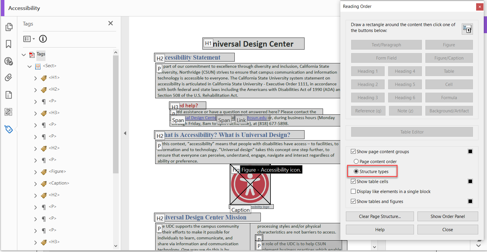

---
*Page 50*
---

## Repair Tag Structure

In case you found incorrect pre-assigned tag i.e.  
 for heading title when it should be tagging as  <H1>. There are three different ways to correct  the tag from 
 to <H1> in below examples. 
Option 1:  Re-draw a rectangle around the  content, select one of the Reading Order  Tool buttons to tag it. 
Option 2:  Double-click the tag i.e. 
  then re-type to <H1> 
Option 3:  Select 
 tag, right-click to select  Properties . Type box: select Heading Level 1 

--- *Tables Found* ---

### Table 1

| 0   | 1   |
|:----|:----|
|     |     |
|     |     |

### Table 2

| 0   |
|:----|
|     |
|     |
|     |
|     |

### Table 3

| 0   | 1   | 2   |
|:----|:----|:----|
|     |     |     |
|     |     |     |

### Table 4

| 0   | 1   | 2   | 3   | 4   |
|:----|:----|:----|:----|:----|
|     |     |     |     |     |
|     |     |     |     |     |
|     |     |     |     |     |
|     |     |     |     |     |
|     |     |     |     |     |

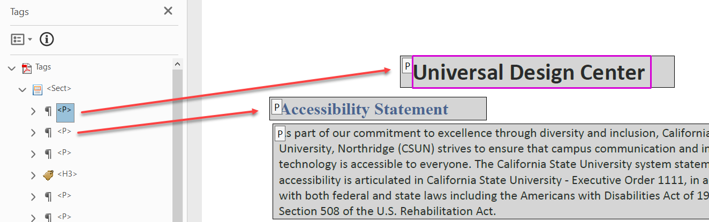

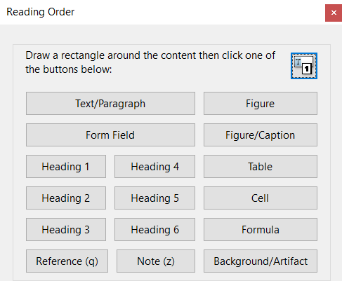

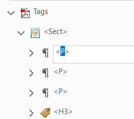

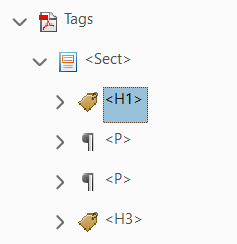

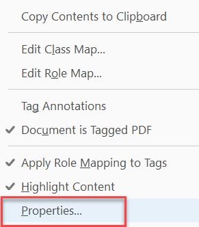

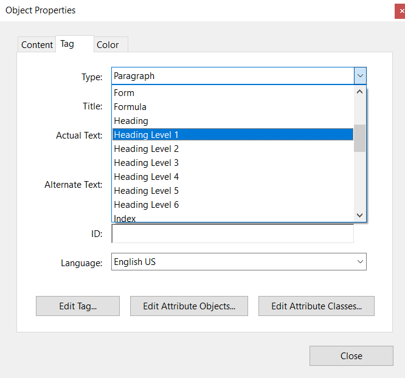

---
*Page 51*
---

## What is the Content Pane?

•  The Content Pane shows you the  elements on a page and hold all the  content within your PDF. 
•  You should be familiar with structural  elements of PDF documents before  editing them in the Content Pane. 
•  The Content Pane can be difficult to  navigate because it is not properly  organized. 
•  Editing your Content Pane is most  helpful when you have PDFs with lots  of graphics or overlapping information.  If content is hidden in your PDF, you  can go to the Content Pane to find it  and reorganize to find the missing info. 

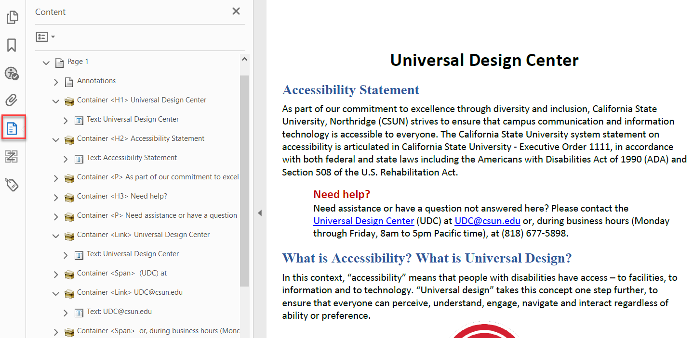

---
*Page 52*
---

## Order Pane

•  DO NOT  use  Order  Pane to  rearrange logical reading order in  sequence. Screen readers like JAWS,  NVDA, VoiceOver don’t use Order  Pane to read the document instead  they use  TAGS  to read the  document. 
•  In theory the Order Pane and Tags  Pane are supposed to match but  often they don’t for more complex  or untagged documents. 
•  If the reading order is incorrect  order, go to  TAGS  Pane to rearrange  the correct order. 

--- *Tables Found* ---

### Table 1

| 0   | 1   | 2   | 3   | 4   | 5   | 6   | 7   | 8   | 9   | 10   | 11   |
|:----|:----|:----|:----|:----|:----|:----|:----|:----|:----|:-----|:-----|
|     |     |     |     |     |     |     |     |     |     |      |      |
|     |     |     |     |     |     |     |     |     |     |      |      |
|     |     |     |     |     |     |     |     |     |     |      |      |
|     |     |     |     |     |     |     |     |     |     |      |      |
|     |     |     |     |     |     |     |     |     |     |      |      |
|     |     |     |     |     |     |     |     |     |     |      |      |
|     |     |     |     |     |     |     |     |     |     |      |      |
|     |     |     |     |     |     |     |     |     |     |      |      |
|     |     |     |     |     |     |     |     |     |     |      |      |
|     |     |     |     |     |     |     |     |     |     |      |      |
|     |     |     |     |     |     |     |     |     |     |      |      |
|     |     |     |     |     |     |     |     |     |     |      |      |
|     |     |     |     |     |     |     |     |     |     |      |      |
|     |     |     |     |     |     |     |     |     |     |      |      |
|     |     |     |     |     |     |     |     |     |     |      |      |

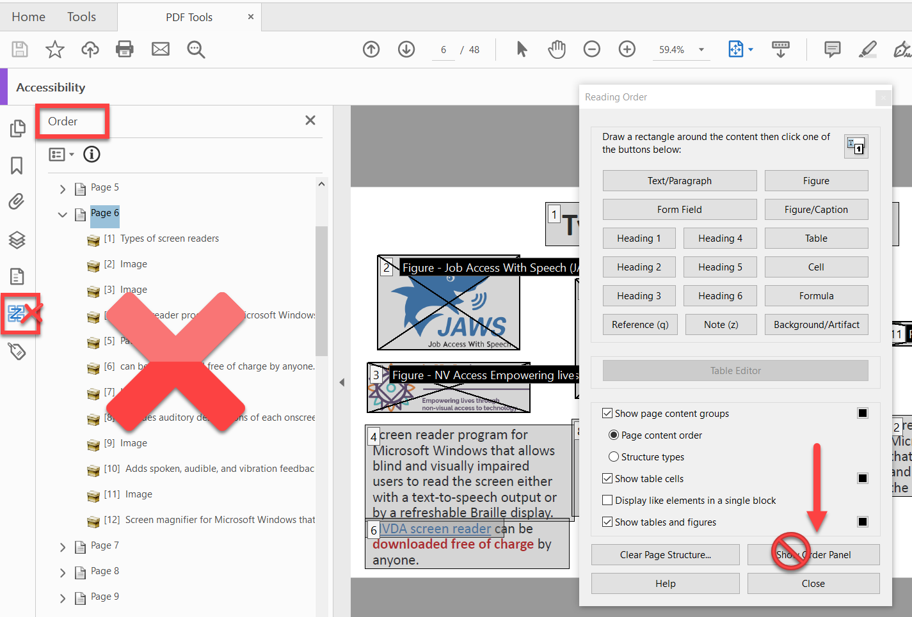

---
*Page 53*
---

## Delete Empty Tags

Empty tags mean no text underneath the tags. Screen  readers will say “ Blank ”. Recommend to delete any empty  tags by selecting 
 or <H2>, right-click to select “Delete  Empty Tags”. 

--- *Tables Found* ---

### Table 1

| 0   | 1   | 2   |
|:----|:----|:----|
|     |     |     |
|     |     |     |
|     |     |     |
|     |     |     |
|     |     |     |

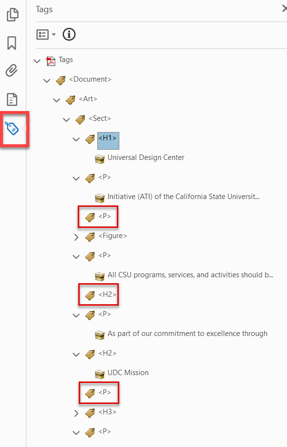

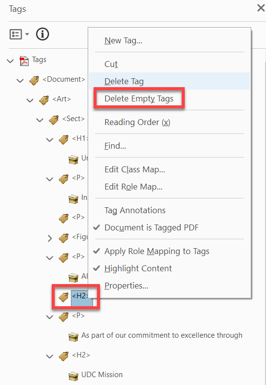

---
*Page 54*
---

## Launch the Tags Pane or the Content Pane

•  If you have errors in an Acrobat  Accessibility Check, you should  have the option to show the  error in either the Content Pane  or the Tags Pane or both. •  This lets you quickly see what  the problem is. •  In most cases, activating/clicking  on the error will let you see what  it is in the document, but being  able to see it in either or both  the Content and Tags Panes  takes you right to the problem. 

--- *Tables Found* ---

### Table 1

| 0   | 1   | 2   | 3   | 4   | 5   | 6   |
|:----|:----|:----|:----|:----|:----|:----|
|     |     |     |     |     |     |     |
|     |     |     |     |     |     |     |
|     |     |     |     |     |     |     |
|     |     |     |     |     |     |     |
|     |     |     |     |     |     |     |
|     |     |     |     |     |     |     |
|     |     |     |     |     |     |     |

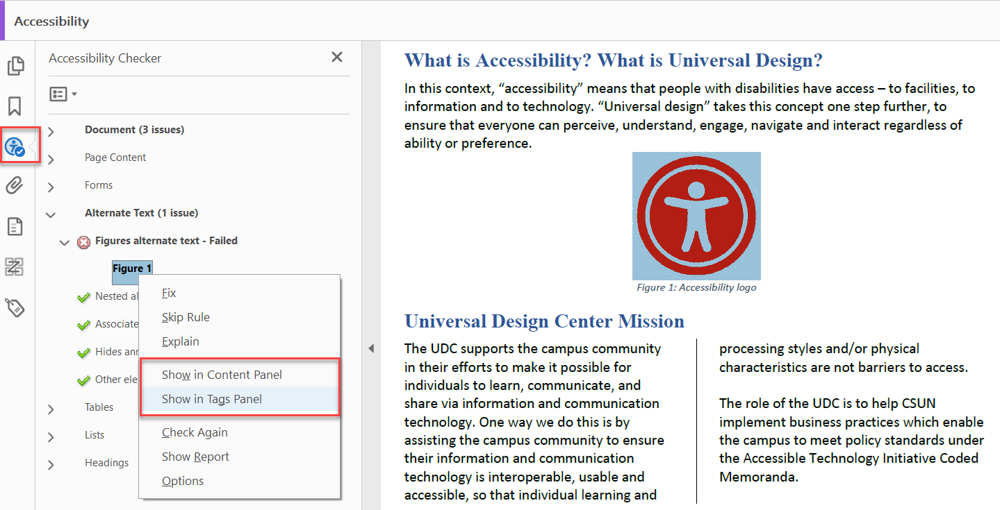

---
*Page 55*
---

## Use screen reader to finalize  your document accessibility features

## DO NOT  use Adobe Acrobats built-in ‘Read Out Lout’ tool as a screen reader. This tool is  NOT a screen reader and will not capture the same information as screen readers below.

Microsoft Windows NVDA  screen reader that allows blind  and visually impaired users to read the screen either with  a text-to-speech output or by a refreshable Braille display.  NVDA can be  downloaded free of charge  by anyone. 
nvaccess.org 
•  Apple VoiceOver  built-in provides  auditory descriptions of each onscreen  element using gestures, a keyboard, or a  braille display. 

---
*Page 56*
---

## Accessibility Tips

• Always save your PDF as you add TAGS  accessibility markup 
• When modifying extensive content in reading  order, drag content down not up 
• Delete empty tags 
• Header, footer, and page numbers, decorative  lines or shapes tag as “Background/artifact” 

---
*Page 57*
---

## Always SAVE your PDF as you  add TAGS accessibility markup

Save it OFTEN to avoid  Adobe  unpredictable crashes ! 

--- *Tables Found* ---

### Table 1

| 0   |
|:----|
|     |
|     |

### Table 2

| 0   | 1   | 2   |
|:----|:----|:----|
|     |     |     |
|     |     |     |
|     |     |     |

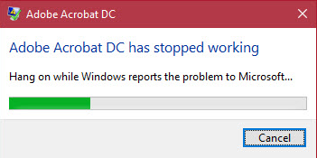

---
*Page 58*
---

*(This page was processed with OCR)*
PDF Accessibility Iterative Process

1

Initial :
ae Fix Common
se tee ny issues/failed
8 iv
Test screen
Congratulations! age

&) —niversal ~esign —~enter

3
Review and
correct tags

6
Final
Accessibility
Check

»
tie

csun.edu/udc

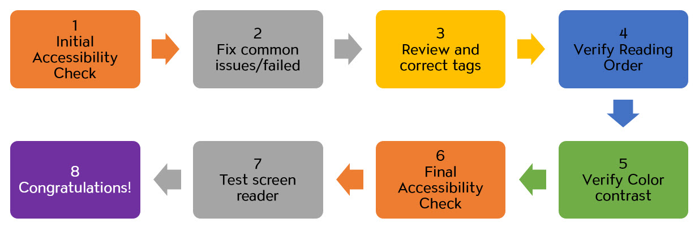

---
*Page 59*
---

## How can we help you make a  difference ?

Universal Design  means design for  everyone 

## Universal Design Center Offers

•  Online, self-paced training •  In-person training each semester •  Consultations •  Tools and Services 

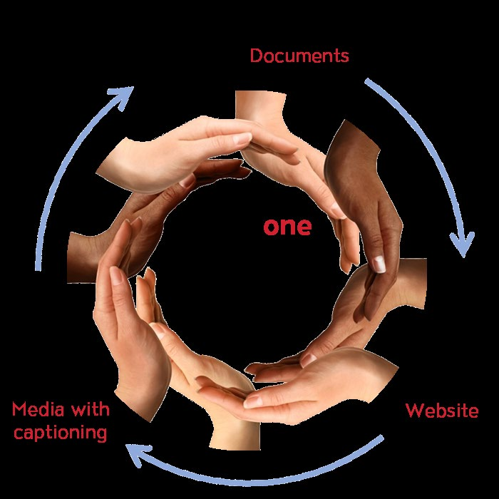

